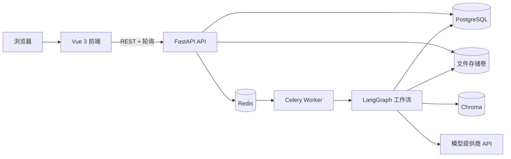
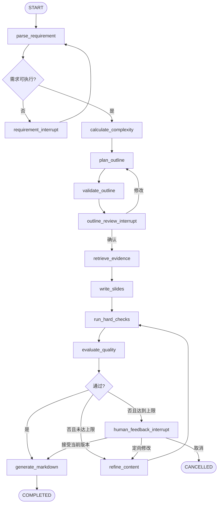

# SlideAI 开发指导

> 文档版本：1.0  
> 编写日期：2026-09-28  
> 需求基线：[需求分析.md](./需求分析.md)  
> 适用范围：SlideAI 首期可用版本（MVP）  
> 主要读者：负责生成项目代码的低级模型、代码审查者、项目维护者

## 1. 文档目标与执行规则

本文把需求基线转换为可直接编码的技术规范。实现者不得在未记录理由的情况下改变本文规定的架构边界、数据含义、接口语义或验收标准。

低级模型执行时必须遵守以下规则：

1. 先阅读 `需求分析.md` 和本文，再开始写代码；需求文档说明“做什么”，本文说明“怎么做”。冲突时以 `需求分析.md` 为准，并停止实现、记录冲突，不能自行猜测。
2. 严格按第 18 节的阶段顺序开发。每次只完成一个可验收任务，不允许一次生成整个项目后再集中修错。
3. 每个功能先写或更新测试，再写最小实现；每一阶段结束必须运行该阶段列出的检查命令。
4. 不得留下 `TODO`、空函数、固定假数据、吞异常的 `except Exception: pass` 或宣称完成但不能运行的占位实现。
5. 所有 LLM 输出必须经过 Pydantic 模型校验；解析失败不得把原始文本直接写入正式业务状态。
6. 所有任务级查询，包括文件、片段、对话、模型调用和页面查询，都必须显式带 `task_id` 条件。禁止先查全量再在 Python 中过滤。
7. API 路由只做鉴权预留、参数校验、调用应用服务和组装响应；业务规则不得堆在路由函数中。
8. LangGraph 节点只负责一个明确步骤。节点不能直接访问 FastAPI 请求对象，不能保存不可序列化对象，也不能在状态中放数据库连接、模型客户端或文件句柄。
9. 模型名称、API 地址、密钥、超时、重试、备用链、评分阈值和修订上限全部来自配置，不能散落在业务代码中。
10. 每次修改后只声称实际验证过的内容。若命令失败，必须保留错误信息并先修复，不能绕过检查。

### 1.1 首期明确不做

- 不生成或编辑 PPTX；
- 不做幻灯片视觉排版、模板市场或图表布局；
- 不做互联网搜索；
- 不做多租户、组织、计费或复杂权限；
- 不让 Agent 自由决定并执行任意工具；
- 不拆成大量微服务；
- 不为了“智能”而增加需求之外的自主循环。

## 2. 已确定的技术决策

### 2.1 架构形态

采用“模块化单体 API + 独立后台 Worker”的架构，而不是微服务：



选择理由：

- FastAPI 请求进程不承担长时间生成，避免 HTTP 超时和进程重启导致任务丢失；
- Worker 可独立重启和扩容，但业务代码仍在一个后端工程中，减少跨服务契约；
- PostgreSQL 同时保存业务记录和 LangGraph 检查点，支持暂停、恢复和故障定位；
- Redis 只作 Celery broker/result backend 和短期协调，不作为业务事实来源；
- Chroma 只存向量和片段检索元数据，原始文件与业务状态仍有独立持久化来源。

### 2.2 技术栈

| 层次 | 选择 | 约束 |
| --- | --- | --- |
| Python | Python 3.12 | 使用类型标注；后端统一由 `uv` 管理并生成锁文件 |
| API | FastAPI + Pydantic v2 | REST API；统一错误结构；OpenAPI 为接口事实来源 |
| ORM/迁移 | SQLAlchemy 2.x async + Alembic | PostgreSQL；每个请求或工作单元独立 `AsyncSession` |
| 工作流 | LangGraph 1.x | `StateGraph`、持久化 checkpointer、`interrupt`/`Command` |
| LLM 适配 | LangChain 1.x + 自定义 `ModelGateway` | 提供商细节只能存在于基础设施层 |
| 后台任务 | Celery 5.x + Redis | Worker 只在 Docker Compose 容器中运行，使用默认 prefork；不支持本机 Python 直接运行 |
| 关系数据库 | PostgreSQL 16+ | JSONB 保存结构化快照；普通列保存查询和约束所需字段 |
| 向量数据库 | Chroma server | 单集合 + `task_id` 元数据过滤；禁止跨任务检索 |
| 文档解析 | PyMuPDF、python-docx | Markdown/TXT 用标准文本读取；UTF-8 优先并处理 BOM |
| 文件存储 | 本地共享卷 + `FileStorage` 接口 | MVP 不引入 S3；路径不得直接暴露给前端 |
| 前端 | Vue 3 + TypeScript + Vite | Composition API、`<script setup lang="ts">`、严格类型检查 |
| 前端状态 | Pinia + TanStack Vue Query | Pinia 管 UI/草稿状态，Query 管服务器状态；禁止重复缓存同一事实 |
| UI | Element Plus | 表单、上传、步骤条、抽屉和消息提示 |
| HTTP | Axios | 统一实例、超时、错误映射和请求 ID |
| Markdown | markdown-it + DOMPurify | 渲染前净化；原始 HTML 默认禁用 |
| 测试 | pytest、pytest-asyncio、Vitest、Vue Test Utils、Playwright | 单元、集成、契约、端到端分层 |
| 质量工具 | Ruff、Pyright、ESLint、Prettier、vue-tsc | CI 中全部执行 |
| 部署 | Docker Compose | `frontend`、`api`、`worker`、`postgres`、`redis`、`chroma` |

依赖版本只锁定兼容主版本，项目初始化后必须提交 `uv.lock` 和前端锁文件。不得在后续任务中无原因升级主版本。

### 2.3 被否决的方案

| 方案 | 不采用原因 |
| --- | --- |
| FastAPI `BackgroundTasks` 直接生成 | 生成和文件处理属于重任务，无法提供可靠的独立进程执行与恢复 |
| 全部同步生成后一次返回 | 易超时，无法展示阶段状态，也无法在人审处暂停 |
| 首期拆分为多个 Agent 微服务 | 部署、事务和接口复杂度高，不能增加首期业务价值 |
| FAISS 进程内索引 | 多 Worker 下共享、持久化、删除和元数据隔离更难 |
| WebSocket 作为首期状态通道 | 当前只需服务端到客户端的低频状态；2 秒轮询更易实现和恢复 |
| 自由 ReAct 循环 | 难以限制调用、复现状态和验收；首期使用显式图节点和确定性工具调用 |
| 把 LangGraph checkpoint 当业务数据库 | checkpoint 适合恢复图状态，不适合作为前端查询、筛选和审计的唯一数据源 |

## 3. 领域模型与统一术语

代码、数据库、API 和界面统一使用以下含义。英文名用于代码，中文名用于界面。

| 中文术语 | 代码名 | 精确定义 |
| --- | --- | --- |
| 生成任务 | `GenerationTask` | 一次从需求到 Markdown 的完整业务实例，是所有资料、对话和结果的聚合根 |
| 结构化需求 | `StructuredRequirement` | Requirement 节点校验通过的需求对象，不等同于用户原文 |
| 大纲 | `Outline` | 有顺序的章节和页面计划；所有条目的 `page_count` 之和必须等于目标页数 |
| 页面 | `Slide` | 演示文稿的一个逻辑页，包含连续页码、标题、要点、备注和引用 |
| 文件 | `SourceFile` | 用户上传的原始资料及其处理状态 |
| 片段 | `DocumentChunk` | 从一个文件定位得到的检索单位，带来源位置和 `task_id` |
| 评估 | `Evaluation` | 对某一内容版本的硬规则结果、分项评分、问题和建议 |
| 修订 | `Revision` | 从一个内容版本到新版本的受控变更，必须记录范围与原因 |
| 修改请求 | `ChangeRequest` | 聊天或表单产生的结构化修改意图；未澄清前不能执行 |
| 模型偏好 | `ModelPreference` | `auto` 或用户指定的模型目录键；是任务级默认偏好 |
| 模型调用 | `ModelCall` | 一次具体节点调用的路由、重试、实际模型、耗时和结果记录 |
| 工作流检查点 | `Checkpoint` | LangGraph 保存的可恢复运行状态，不直接作为业务展示对象 |

### 3.1 聚合边界

`GenerationTask` 是聚合根。外部 API 不允许单独创建 Slide、Evaluation 或 Revision，它们只能在任务上下文中产生。`SourceFile` 可以独立上传和删除，但一旦任务进入 `RUNNING`，正在使用的文件不能物理删除，只能标记删除并在当前运行结束后清理。

### 3.2 版本与并发规则

- `GenerationTask`、`Outline` 和当前内容均有整数 `version`，每次成功修改加 1；
- 修改大纲、页面或确认变更时必须提交 `expected_version`；
- 版本不一致返回 HTTP `409`，错误码 `VERSION_CONFLICT`，不得用后写覆盖先写；
- 每个任务同一时刻最多有一个工作流运行。Redis 分布式锁键为 `slideai:task-lock:{task_id}`，设置可续租 TTL；
- Celery 任务必须具备幂等性：重复投递时若业务运行已完成、正在执行或幂等键已消费，不得重复生成。

## 4. 仓库结构

采用单仓库。初始目录必须按下列结构创建；新增文件应放在责任最相近的目录，不得创建 `utils.py` 大杂烩。

```text
SlideAI/
├─ docs/
│  ├─ README.md
│  ├─ 项目说明.md
│  ├─ 需求分析.md
│  ├─ 开发指导.md
│  ├─ 前端设计.md
│  ├─ 前端效果图.jpg
│  ├─ ui-mockups/
│  ├─ ui-mockups-v2/
│  └─ ui-mockups-final/
├─ .gitignore
├─ .env.example
├─ docker-compose.yml
├─ backend/
│  ├─ pyproject.toml
│  ├─ uv.lock
│  ├─ alembic.ini
│  ├─ migrations/
│  ├─ config/
│  │  ├─ models.example.yaml
│  │  └─ prompts/
│  ├─ src/slideai/
│  │  ├─ main.py
│  │  ├─ api/
│  │  │  ├─ dependencies.py
│  │  │  ├─ errors.py
│  │  │  └─ v1/
│  │  │     ├─ router.py
│  │  │     ├─ tasks.py
│  │  │     ├─ files.py
│  │  │     ├─ outlines.py
│  │  │     ├─ slides.py
│  │  │     ├─ chat.py
│  │  │     └─ models.py
│  │  ├─ core/
│  │  │  ├─ config.py
│  │  │  ├─ logging.py
│  │  │  ├─ security.py
│  │  │  └─ exceptions.py
│  │  ├─ domain/
│  │  │  ├─ enums.py
│  │  │  ├─ entities.py
│  │  │  ├─ value_objects.py
│  │  │  └─ policies.py
│  │  ├─ application/
│  │  │  ├─ dto.py
│  │  │  ├─ ports.py
│  │  │  └─ services/
│  │  ├─ infrastructure/
│  │  │  ├─ db/
│  │  │  ├─ repositories/
│  │  │  ├─ llm/
│  │  │  ├─ rag/
│  │  │  ├─ documents/
│  │  │  └─ storage/
│  │  ├─ workflow/
│  │  │  ├─ state.py
│  │  │  ├─ graph.py
│  │  │  ├─ routing.py
│  │  │  ├─ nodes/
│  │  │  └─ prompts/
│  │  └─ workers/
│  │     ├─ celery_app.py
│  │     └─ tasks.py
│  └─ tests/
│     ├─ unit/
│     ├─ integration/
│     ├─ contract/
│     └─ fixtures/
├─ frontend/
│  ├─ package.json
│  ├─ pnpm-lock.yaml
│  ├─ vite.config.ts
│  ├─ src/
│  │  ├─ main.ts
│  │  ├─ router/
│  │  ├─ api/
│  │  ├─ stores/
│  │  ├─ types/
│  │  ├─ composables/
│  │  ├─ components/
│  │  └─ views/
│  └─ tests/
└─ e2e/
   └─ tests/
```

依赖方向必须是：`api -> application -> domain`，`infrastructure -> application/domain`，`workflow -> application/domain`。`domain` 不得导入 FastAPI、SQLAlchemy、LangChain、LangGraph、Celery 或 Chroma。

## 5. 后端分层职责

### 5.1 Domain

包含枚举、值对象、纯业务规则和不依赖框架的实体。例如：页数和大纲页数一致性、状态转换是否合法、修改范围是否有效、评分是否通过。

### 5.2 Application

组织用例并定义端口：

- `TaskRepository`、`FileRepository`、`RevisionRepository`；
- `FileStorage`；
- `VectorStore`；
- `ModelGateway`；
- `TaskQueue`；
- `Clock` 和 `IdGenerator`，便于测试。

应用服务负责事务边界。一个服务方法完成一次可描述的业务动作，如 `create_task`、`start_generation`、`confirm_outline`、`submit_chat_message`。

### 5.3 Infrastructure

实现数据库、模型、向量库、解析器和文件系统端口。任何供应商 SDK 对象都不能越过此层。

### 5.4 Workflow

定义 LangGraph 状态、节点、边和恢复逻辑。节点通过应用端口访问外部能力；节点返回纯字典状态增量。节点中不得 `commit` 多个互不相关的业务修改。

### 5.5 API

只处理 HTTP 语义。Pydantic 请求模型与领域实体分开，防止把数据库字段直接暴露为接口。

## 6. 数据库设计

所有主键使用 UUID4，时间使用带时区的 UTC `timestamptz`。界面再按浏览器时区显示。JSON 字段使用 PostgreSQL `jsonb`。

### 6.1 主要数据表

#### `generation_tasks`

| 字段 | 类型 | 说明 |
| --- | --- | --- |
| `id` | uuid PK | 任务 ID，同时作为 LangGraph `thread_id` |
| `status` | varchar | 第 7 节定义的任务状态 |
| `current_stage` | varchar | 当前工作流阶段 |
| `raw_requirement` | jsonb | 用户原始表单，不覆盖 |
| `structured_requirement` | jsonb null | 校验后的结构化需求 |
| `model_preference` | jsonb | 自动模式或首选模型键 |
| `task_complexity` | jsonb null | 等级、分值和判断依据 |
| `outline` | jsonb null | 当前大纲快照 |
| `slides_content` | jsonb null | 当前页面快照 |
| `evaluation_result` | jsonb null | 当前评估快照 |
| `final_markdown` | text null | 当前可下载版本 |
| `revision_count` | int | 自动修订次数，默认 0 |
| `version` | int | 乐观锁版本，默认 1 |
| `workflow_fencing_generation` | bigint? | 当前 Worker 租约代数；递增并持久化，拒绝过期租约写入 |
| `last_error_code` | varchar null | 可机器处理的错误码 |
| `last_error_message` | text null | 脱敏后的用户可读信息 |
| `created_at/updated_at/completed_at` | timestamptz | 时间字段 |

索引：`status`、`updated_at`、`(status, current_stage)`。

#### `source_files`

字段：`id`、`task_id` FK、`original_name`、`stored_name`、`mime_type`、`extension`、`size_bytes`、`sha256`、`status`、`error_code`、`error_message`、`chunk_count`、`created_at`、`updated_at`、`deleted_at`。

约束与索引：

- `(task_id, sha256)` 唯一，防止同任务重复上传；
- `size_bytes > 0`；
- 索引 `(task_id, status)`；
- `stored_name` 使用随机 UUID，不使用用户文件名作为磁盘路径。

#### `document_chunks`

关系库保存可审计的片段元数据和文本，Chroma 保存相同 `id` 的向量记录。字段：`id`、`task_id`、`file_id`、`ordinal`、`content`、`token_count`、`page_number`、`section_title`、`paragraph_index`、`embedding_model`、`embedding_version`、`created_at`。

#### `revisions`

字段：`id`、`task_id`、`sequence`、`kind`（`AUTO_REFINE`、`USER_EDIT`、`CHAT_CHANGE`、`REGENERATE`、`UNDO`）、`scope` jsonb、`reason`、`before_snapshot` jsonb、`after_snapshot` jsonb、`evaluation_id`、`created_at`。

首期为支持撤销保留完整 JSON 快照，避免实现复杂 JSON Patch；后续数据量增大再优化。

#### `evaluations`

字段：`id`、`task_id`、`content_version`、`total_score`、`passed`、`hard_checks` jsonb、`dimension_scores` jsonb、`issues` jsonb、`suggestions` jsonb、`model_call_id`、`created_at`。

#### `conversations` 与 `chat_messages`

一个任务首期只有一个对话。消息字段：`id`、`conversation_id`、`role`、`content`、`target` jsonb、`parsed_change_request` jsonb、`execution_status`、`created_at`。系统提示词不作为普通消息返回前端。

#### `model_calls`

字段：`id`、`task_id`、`workflow_node`、`requested_tier`、`preferred_model_key`、`actual_model_key`、`attempt_no`、`fallback_from`、`route_reason` jsonb、`request_tokens`、`response_tokens`、`latency_ms`、`status`、`error_type`、`error_message`、`created_at`。

禁止保存完整 API key。原始 Prompt 默认不写普通日志；如开发环境需要调试，只保存脱敏内容并由开关控制。

#### `change_requests`

字段：`id`、`task_id`、`source_message_id`、`target_type`、`target_ids` jsonb、`operation`、`instruction`、`impact_scope` jsonb、`risk_level`、`status`、`expected_task_version`、`created_at`、`resolved_at`。

### 6.2 事务原则

- 数据库写入与 Celery 投递采用 transactional outbox，避免“DB 已提交但任务未投递”；
- `outbox_events` 记录 `event_type`、`aggregate_id`、`payload`、`published_at`；独立发布器投递后标记；
- 每个工作流 outbox 事件 ID 与任务的 `active_workflow_event_id` 在同一事务提交；Worker 获得任务锁后复核任务状态和事件 ID，旧事件重复投递时不执行过期 checkpoint。Redis 为每个任务持久化递增租约代数，数据库在 Worker 接手时记录代数；进度、页面批次、修订、状态投影和失败标记在任务行锁下校验当前代数，阻止过期 Worker 覆盖新结果。锁忙时当前事件会退避重试，失效事件会被确认丢弃；
- 工作流节点的业务结果先持久化，再更新阶段；失败时事务回滚；
- Chroma 和文件系统不是同一事务资源。使用可重试的补偿任务清理孤儿向量和孤儿文件；
- API 不做跨网络长事务。

## 7. 状态机

### 7.1 任务状态

```text
DRAFT
  -> FILES_PROCESSING
  -> READY
  -> RUNNING
  -> WAITING_REQUIREMENT_INPUT
  -> WAITING_OUTLINE_CONFIRMATION
  -> WAITING_USER_FEEDBACK
  -> COMPLETED

任一可运行状态 -> FAILED_RETRYABLE -> RUNNING
任一未终结状态 -> CANCELLED
不可恢复错误 -> FAILED_FINAL
```

规则：

- `DRAFT`：可编辑需求、模型偏好和文件；
- `FILES_PROCESSING`：至少一个文件处理中；无文件任务可直接进入 `READY`；
- `READY`：需求基本字段有效，所有保留文件均为 `READY`；失败文件必须由用户移除或明确忽略；
- `RUNNING`：Worker 正在执行，不允许并发启动；
- `WAITING_REQUIREMENT_INPUT`：需求缺失或冲突，等待补充；
- `WAITING_OUTLINE_CONFIRMATION`：大纲已生成，等待确认或编辑；
- `WAITING_USER_FEEDBACK`：自动修订达到上限或高影响变更等待用户；
- `COMPLETED`：存在可下载 Markdown，但用户后续修改可使任务再次进入 `RUNNING`；
- `FAILED_RETRYABLE`：现场和失败节点已保存，可重试；
- `FAILED_FINAL`：配置、认证、输入破坏或不可恢复错误，需要维护者处理；
- `CANCELLED`：停止后续节点，不删除既有数据。

### 7.2 文件状态

`UPLOADED -> PARSING -> CHUNKING -> EMBEDDING -> READY`，任一步可进入 `FAILED`。删除使用 `DELETED` 软删除状态，清理任务成功后再物理删除。

### 7.3 变更请求状态

`PARSED -> NEEDS_CLARIFICATION | NEEDS_CONFIRMATION | EXECUTING -> APPLIED | FAILED | CANCELLED`。

## 8. LangGraph 工作流设计

### 8.1 `SlideState`

使用 `TypedDict` 定义图状态，复杂字段使用 Pydantic DTO 校验后再转为 JSON 可序列化字典。至少包含：

```python
class SlideState(TypedDict, total=False):
    task_id: str
    run_id: str
    raw_requirement: dict[str, object]
    user_requirement: dict[str, object]
    outline: dict[str, object]
    retrieved_documents: dict[str, list[dict[str, object]]]
    slides_content: list[dict[str, object]]
    evaluation_result: dict[str, object]
    revision_count: int
    revision_scope: dict[str, object] | None
    human_feedback: dict[str, object] | None
    conversation_context: list[dict[str, object]]
    pending_change: dict[str, object] | None
    model_preference: dict[str, object]
    task_complexity: dict[str, object]
    model_call_history_ids: list[str]
    final_markdown: str | None
    last_error: dict[str, object] | None
```

图状态只放本次运行所需的当前数据和记录 ID，不无限累积完整 Prompt、二进制文件或所有历史版本。历史由业务表保存。

### 8.2 主图



### 8.3 节点契约

| 节点 | 输入 | 输出 | 不能做的事 |
| --- | --- | --- | --- |
| `parse_requirement` | 原始需求、初始模型偏好 | `StructuredRequirement` 或结构化澄清项 | 不生成大纲 |
| `calculate_complexity` | 需求、文件元数据/解析统计 | 分值、等级、理由 | 不直接选死模型 ID |
| `plan_outline` | 结构化需求、模型路由结果 | `Outline` | 不生成页面正文 |
| `validate_outline` | 大纲、目标页数 | 硬规则问题 | 不调用 LLM 修正简单算术错误 |
| `retrieve_evidence` | 大纲、当前任务 | 按页面计划分组的片段 | 不检索其他任务 |
| `write_slides` | 需求、大纲、检索片段 | 完整页面列表 | 不改变目标页数和大纲 ID |
| `run_hard_checks` | 页面和需求 | 确定性检查结果 | 不调用 LLM |
| `evaluate_quality` | 所有当前产物、硬检查 | 评分、问题、建议 | 不直接修改页面 |
| `refine_content` | 页面、问题、范围、反馈 | 新页面版本 | 不改动范围外页面 |
| `generate_markdown` | 已接受内容 | 确定性 Markdown | 不让 LLM 自由重写内容 |

### 8.4 持久化和恢复

- 生产使用 PostgreSQL checkpointer；内存 checkpointer 仅用于单元测试；
- `thread_id = task_id`，长度固定为 UUID 字符串；
- 每个需要人类输入的节点使用 `interrupt()`，恢复时使用相同 `thread_id` 和 `Command(resume=...)`；
- `interrupt()` 之前的代码会在恢复时重新执行，因此中断前不得执行非幂等外部副作用；需要的副作用应放在中断返回之后或加幂等键；
- Worker 崩溃后从失败节点恢复，不从头重跑已完成节点；
- 业务表保存便于前端读取的投影，checkpoint 保存执行现场，两者不能互相替代；
- 定期清理超过保留期的 checkpoint，清理前不得删除仍可恢复的任务。

### 8.5 Writer 的生成策略

首期按“章节批次”生成，不一次生成整份长文，也不为每页创建一个 Celery 任务。每批最多 5 页：

1. 输入全局需求、精简大纲、相邻页面摘要和本批检索片段；
2. 模型返回严格的 `SlideBatch` JSON；
3. 校验页码、ID、数量和字段长度；
4. 写入批次结果并更新进度；
5. 下一批携带上一批的标题和一句摘要，保持连贯且控制上下文。

若某批失败，只重试该批。所有批次完成后执行全局硬检查和质量评估。

## 9. Pydantic 输出模型

至少定义以下模型，所有字段使用 `Field` 描述和边界：

```text
StructuredRequirement
  topic: str (1..200)
  target_page_count: int (3..50，配置可改)
  scenario: str | None
  audience: str
  style: str
  constraints: list[str]
  language: str = "zh-CN"
  source_usage: Literal["required", "preferred", "optional"]
  original_text: str | None

Outline
  title: str
  sections: list[OutlineSection]

OutlineSection
  id: str
  title: str
  objective: str
  page_count: int
  items: list[OutlineItem]

Slide
  id: str
  page_number: int
  section_id: str
  title: str
  bullets: list[str] (2..6)
  speaker_notes: str | None
  citations: list[Citation]
  verification_notes: list[str]

EvaluationResult
  total_score: int (0..100)
  passed: bool
  hard_checks: list[HardCheck]
  dimensions: list[DimensionScore]
  issues: list[EvaluationIssue]
  suggestions: list[str]

ChangeRequest
  target_type: Literal["outline_item", "section", "slide", "whole_deck"]
  target_ids: list[str]
  operation: Literal["replace", "rewrite", "expand", "shorten", "reorder", "regenerate"]
  instruction: str
  risk_level: Literal["local", "wide", "constraint_change"]
  needs_clarification: bool
  clarification_question: str | None
```

结构化输出修复策略：首次校验失败，把精简后的校验错误反馈给同一模型做一次格式修复；仍失败则记录 `OUTPUT_VALIDATION_ERROR`。不得用正则从任意自然语言中拼凑正式对象。

## 10. 模型目录、路由与降级

### 10.1 模型目录配置

`backend/config/models.example.yaml` 的结构固定如下，真实配置可通过环境变量指定路径：

```yaml
models:
  deepseek_flash:
    display_name: DeepSeek Flash
    provider: openai_compatible
    model_id: ${DEEPSEEK_FLASH_MODEL_ID}
    base_url: ${DEEPSEEK_BASE_URL}
    api_key_env: DEEPSEEK_API_KEY
    tier: fast
    enabled: true
    timeout_seconds: 60
    fallbacks: []
  deepseek_pro:
    display_name: DeepSeek Pro
    provider: openai_compatible
    model_id: ${DEEPSEEK_PRO_MODEL_ID}
    base_url: ${DEEPSEEK_BASE_URL}
    api_key_env: DEEPSEEK_API_KEY
    tier: balanced
    enabled: true
    timeout_seconds: 90
    fallbacks: [deepseek_flash]
  glm_advanced:
    display_name: GLM
    provider: openai_compatible
    model_id: ${GLM_MODEL_ID}
    base_url: ${GLM_BASE_URL}
    api_key_env: GLM_API_KEY
    tier: advanced
    enabled: true
    timeout_seconds: 120
    fallbacks: [deepseek_pro, deepseek_flash]
node_policies:
  parse_requirement: { minimum_tier: fast }
  plan_outline: { minimum_tier: balanced }
  write_slides: { minimum_tier: balanced }
  evaluate_quality: { minimum_tier: balanced }
  refine_content: { minimum_tier: balanced }
```

`${...}` 只在加载配置时从环境变量展开。`GET /models` 只返回目录键、显示名、档位和可用状态，不返回 `base_url`、`model_id` 或密钥环境变量名。

### 10.2 自动复杂度规则

初始评估使用表单和文件元数据，Requirement 完成后用解析结果重新计算。五项各取 0、1、2 分：

| 特征 | 0 分 | 1 分 | 2 分 |
| --- | --- | --- | --- |
| 页数 | `<= 8` | `9..15` | `> 15` |
| 资料规模 | `<= 20k` 估算 token | `20k..100k` | `> 100k` |
| 约束数 | `<= 2` | `3..5` | `> 5` |
| 领域专业度 | 通用介绍 | 专业业务/技术 | 高专业或跨领域 |
| 分析深度 | 概述/总结 | 比较/方案 | 战略、论证或多步推理 |

总分 `0..3 = fast`，`4..6 = balanced`，`7..10 = advanced`。领域专业度和分析深度由 Requirement 输出枚举，不能直接依赖模型的一段解释性文字。最终记录每一项得分。

节点策略可以把档位向上提升，不能在自动模式中降到节点最低档位以下。手动模式始终先尝试用户指定模型，不再被复杂度替换，但仍允许按该模型的备用链降级。

### 10.3 重试和降级分类

| 错误 | 同模型重试 | 切备用模型 | 结果 |
| --- | --- | --- | --- |
| 超时、连接失败、HTTP 429、HTTP 5xx | 最多 2 次，指数退避加抖动 | 是 | 全部失败则 `FAILED_RETRYABLE` |
| 结构化输出校验失败 | 1 次格式修复 | 修复仍失败时可切一次兼容模型 | 失败节点可重试 |
| HTTP 400 参数错误 | 否 | 否 | `FAILED_FINAL`，提示配置或代码错误 |
| HTTP 401/403 | 否 | 否 | `FAILED_FINAL`，只显示脱敏提示 |
| 内容安全拒绝 | 否 | 否 | 等待用户修改输入 |
| 用户取消 | 否 | 否 | `CANCELLED` |

每次尝试都写 `model_calls`。模型降级会更新任务的“本次实际模型”，但不覆盖用户原始偏好。

### 10.4 `ModelGateway` 接口

应用层只依赖类似以下协议：

```python
class ModelGateway(Protocol):
    async def invoke_structured(
        self,
        *,
        task_id: UUID,
        node: WorkflowNode,
        messages: Sequence[ModelMessage],
        output_schema: type[T],
        preference: ModelPreference,
        complexity: TaskComplexity,
        idempotency_key: str,
    ) -> ModelResult[T]: ...
```

重试、降级、耗时统计和调用记录由网关统一实现，Agent 节点不重复实现。

## 11. RAG 与文件处理

### 11.1 上传限制默认值

- 扩展名：`.pdf`、`.md`、`.txt`、`.docx`；不接收旧 `.doc`；
- 单文件最大 20 MiB；
- 单任务最多 10 个文件；
- 解压缩后的文本最大 2,000,000 字符/文件；
- 服务端同时校验扩展名、MIME、文件签名和大小；
- 文件名只作显示，不参与保存路径；清理路径穿越字符；
- 对 PDF/Word 中的宏、脚本或嵌入对象不执行；
- 扫描版 PDF 首期不做 OCR，返回 `NO_EXTRACTABLE_TEXT`。

这些值必须放入配置并在前端展示，修改配置无需改业务代码。

### 11.2 解析定位

- PDF：PyMuPDF 按页提取，`page_number` 从 1 开始；
- DOCX：按标题和段落顺序提取，保存 `section_title`、`paragraph_index`；
- Markdown：按标题层级切分，保存最近标题路径；
- TXT：按段落切分，定位使用 `paragraph_index`；
- 空白、只有图片或乱码比例过高时标记失败并给用户明确原因。

### 11.3 切分与向量化

默认使用 tokenizer 估算的 800 token 分块、120 token 重叠，优先在标题、段落和句号边界切分。不得在一个片段中混合不同 PDF 页或不同一级标题，除非单段本身超过上限。

每种 Embedding 维度与版本组合使用一个 Chroma 集合，名称为
`slideai_chunks_d{dimensions}_{version}`，例如 `slideai_chunks_d64_v1`。更换 Embedding 模型时提升
`EMBEDDING_VERSION`，避免新旧向量写入维度或向量空间不兼容的集合。每条记录元数据至少有：

```json
{
  "task_id": "uuid",
  "file_id": "uuid",
  "chunk_id": "uuid",
  "page_number": 3,
  "section_title": "可为空",
  "embedding_model": "配置键",
  "embedding_version": "v1"
}
```

检索必须带等值条件 `task_id == 当前任务`，有指定文件范围时再加 `file_id`。默认每个页面计划检索 `top_k=6`，使用 MMR 或等价去重策略。最低相似度阈值可配置；无合格片段时返回空列表，不伪造引用。

### 11.4 引用

`Citation` 保存 `chunk_id`、`file_id`、显示文件名、页码/章节、支持该要点的简短摘录。Writer 只能引用本次 Prompt 中提供的片段 ID。Markdown 使用：

```text
[来源：行业报告.pdf，第 12 页]
```

同页重复来源合并。缺少资料支撑的可疑事实写入 `verification_notes`，显示“待核实”，不得创建虚假来源。

### 11.5 Prompt 注入防护

上传资料是“不可信数据”，不是系统指令。系统 Prompt 必须明确：忽略资料中要求改变角色、泄漏提示词、调用外部工具或绕过规则的文字。检索片段使用清晰的数据边界标签包裹。首期不允许文档触发任何工具或网络请求。

## 12. 评估与自动修订

### 12.1 先硬规则、后 LLM 评分

硬规则由 Python 确定性执行：

- 页面数等于目标页数；
- 页码从 1 连续到目标页数；
- 每页标题非空；
- 每页 2..6 条核心要点；
- 不存在重复页面 ID；
- 必需章节/关键词满足结构化需求；
- 引用的 `chunk_id` 属于当前任务；
- 所有大纲页面分配之和等于目标页数。

任一阻塞性硬规则失败，`passed` 必须为 `false`，即使 LLM 总分高于阈值。

### 12.2 评分默认值

| 维度 | 权重 |
| --- | ---: |
| 完整性 | 25 |
| 逻辑性 | 25 |
| 内容质量 | 25 |
| 用户需求符合度 | 25 |

默认通过条件：总分 `>= 85` 且无阻塞性硬规则失败。阈值和权重可配置，权重之和启动时必须校验为 100。Evaluator 的每个问题必须包含 `code`、`severity`、`scope`、`description` 和可执行建议。

### 12.3 修订规则

- 默认最多自动修订 2 次；
- Refiner 只接收存在问题的页面、必要的相邻页面摘要和评估意见；
- 修改后用稳定 ID 合并回完整页面列表；范围外页面必须字节级结构相等；
- 每次修订写 `revisions`，保存前后快照；
- 每次修订后重跑全部硬规则；LLM 质量评估可以聚焦变更范围，但必须检查整体逻辑摘要；
- 达到上限后 `interrupt`，展示当前版本、分数、问题和可选动作；不得无限循环。

## 13. 聊天助手与定向修改

聊天助手是“自然语言到结构化修改请求”的适配层，不直接拥有任意写权限。

### 13.1 处理流程

1. 保存用户消息；
2. 收集当前任务版本、当前页面上下文和用户显式选择对象；
3. 使用结构化输出解析 `ChangeRequest`；
4. 通过确定性代码验证目标 ID 和操作是否合法；
5. 目标不明确：状态设为 `NEEDS_CLARIFICATION`，只返回一个具体问题；
6. 局部、明确且不改变关键约束：创建快照后执行；
7. 跨章节、改变页数、改变大纲结构或影响超过 30% 页面：计算影响范围，状态设为 `NEEDS_CONFIRMATION`；
8. 用户确认后，以 `expected_task_version` 执行；版本冲突则重新分析，不沿用旧请求；
9. 修改内容后重新执行硬检查和评估；
10. 返回修改摘要、受影响 ID、新版本号和可撤销的 revision ID。

### 13.2 大纲修改影响分析

- 只改标题且页面尚未生成：直接改大纲；
- 只改标题但已有页面：列出该条目映射的页面，询问是否同步重生成；
- 改 `page_count`：属于关键约束变更，必须展示新的页数分配方案；
- 删除/新增/重排条目：必须确认，且只重生成被影响页面；
- 未受影响页面保留 ID 和内容。

### 13.3 撤销

首期只允许撤销当前任务最近一次尚未被后续修改覆盖的用户/聊天修订。撤销创建新的 `UNDO` revision，而不是删除历史记录。自动修订不单独提供界面撤销；用户可接受上一个内容快照恢复。

## 14. REST API 契约

统一前缀 `/api/v1`，JSON 字段使用 `snake_case`。成功响应直接返回资源；错误响应使用：

```json
{
  "error": {
    "code": "VERSION_CONFLICT",
    "message": "任务已被其他操作更新，请刷新后重试",
    "details": {"expected_version": 3, "actual_version": 4},
    "request_id": "uuid"
  }
}
```

### 14.1 核心端点

| 方法与路径 | 作用 | 主要响应/规则 |
| --- | --- | --- |
| `GET /models` | 获取前端可选模型 | 不返回敏感配置 |
| `POST /tasks` | 创建草稿任务 | 返回任务 ID、状态、版本 |
| `GET /tasks/{task_id}` | 获取任务摘要和当前阶段 | 前端轮询此接口 |
| `PATCH /tasks/{task_id}` | 修改草稿需求/模型偏好 | 需 `expected_version`；仅允许可编辑状态 |
| `POST /tasks/{task_id}/files` | 上传单个文件 | `multipart/form-data`；返回文件状态 |
| `GET /tasks/{task_id}/files` | 文件列表 | 包含处理进度和可读错误 |
| `DELETE /tasks/{task_id}/files/{file_id}` | 移除文件 | 运行中标记待删除 |
| `POST /tasks/{task_id}/start` | 启动/恢复生成 | 接受幂等键；返回 `202` |
| `POST /tasks/{task_id}/retry` | 从可恢复失败节点继续 | 只允许 `FAILED_RETRYABLE` |
| `POST /tasks/{task_id}/cancel` | 取消后续执行 | 返回最新状态 |
| `GET /tasks/{task_id}/outline` | 获取大纲 | 返回版本和影响状态 |
| `PUT /tasks/{task_id}/outline` | 用户编辑大纲 | 完整替换且后端重校验 |
| `POST /tasks/{task_id}/outline/confirm` | 确认并恢复工作流 | `Command(resume=...)` |
| `GET /tasks/{task_id}/slides` | 获取当前页面 | 按页码排序 |
| `POST /tasks/{task_id}/regenerations` | 指定页面/章节重生成 | 返回 `202` 和 revision/run ID |
| `POST /tasks/{task_id}/feedback` | 接受或提交反馈 | 明确 `action` 和范围 |
| `GET /tasks/{task_id}/evaluations/latest` | 最新评估 | 含硬检查和建议 |
| `GET /tasks/{task_id}/model-calls` | 调用与降级记录 | 不返回 Prompt 和密钥 |
| `GET /tasks/{task_id}/chat/messages` | 对话历史 | 分页、按时间正序 |
| `POST /tasks/{task_id}/chat/messages` | 发送聊天消息 | 返回消息和 change request 状态 |
| `POST /tasks/{task_id}/changes/{change_id}/confirm` | 确认高影响修改 | 校验任务版本 |
| `POST /tasks/{task_id}/revisions/{revision_id}/undo` | 撤销最近变更 | 不满足条件返回 `409` |
| `GET /tasks/{task_id}/markdown` | Markdown 预览 | JSON 中返回文本和版本 |
| `GET /tasks/{task_id}/markdown/download` | 下载文件 | `text/markdown; charset=utf-8` |

### 14.2 状态轮询

前端在任务运行时每 2 秒请求 `GET /tasks/{id}`，页面失去焦点时降到 10 秒；终结或等待用户状态时停止。响应包含：

```json
{
  "id": "uuid",
  "status": "RUNNING",
  "current_stage": "WRITE_SLIDES",
  "progress": {"completed": 7, "total": 15, "unit": "slides"},
  "version": 5,
  "model_status": {
    "preference": "auto",
    "actual_model": "deepseek_pro",
    "fallback_occurred": false
  },
  "next_actions": []
}
```

`progress` 是阶段内可解释进度，不伪造总百分比。未来可增加 SSE，但不能改变现有资源 API。

### 14.3 HTTP 状态码

- `200/201`：同步成功；
- `202`：任务已接受，异步处理中；
- `400`：请求语义错误；
- `404`：任务或子资源不存在；
- `409`：状态不允许、版本冲突、重复运行；
- `413`：文件过大；
- `415`：文件类型不支持；
- `422`：字段验证失败；
- `429`：系统侧频率或容量限制；
- `500`：未知服务端错误，返回 request ID，不泄漏栈。

## 15. 前端设计

### 15.1 页面与路由

| 路由 | 页面职责 |
| --- | --- |
| `/` | 任务入口；首期可显示最近本地访问任务 |
| `/tasks/new` | 需求表单、模型选择、文件上传 |
| `/tasks/:id/progress` | 文件和工作流阶段、错误、实际模型/降级信息 |
| `/tasks/:id/outline` | 大纲树、页数统计、编辑、确认、聊天抽屉 |
| `/tasks/:id/result` | 页面内容、评估、聊天抽屉、局部重生成、撤销、Markdown 导出 |

### 15.2 组件边界

至少拆分：

- `RequirementForm`：只处理表单与客户端校验；
- `ModelSelector`：自动/手动选择和档位说明；
- `SourceFileUploader`：上传队列与每文件状态；
- `WorkflowStagePanel`：显示阶段、进度和可执行动作；
- `OutlineEditor`：树形编辑与页数合计，禁止直接发请求；
- `SlideList` / `SlideCard`：展示页面和引用；
- `EvaluationPanel`：分数、硬规则、问题、建议；
- `ChatDrawer`：消息、目标对象、澄清/确认卡片；
- `ModelCallBadge`：首选、实际模型和降级原因；
- `MarkdownPreview`：安全渲染、复制、下载。

页面组件负责组合，API 调用放 `api/`，轮询和业务交互放 composable。单个 `.vue` 文件超过约 300 行时应检查是否需要拆分，但不能为追求行数机械拆分。

### 15.3 状态管理

- TanStack Query：任务、文件、大纲、页面、评估、消息等服务端状态；
- Pinia：当前选中页面、聊天抽屉开关、未提交表单和界面偏好；
- 服务端状态变更成功后使相关 query 失效并重取，禁止手工维护多份互相矛盾的缓存；
- 路由刷新后必须能仅凭 `task_id` 恢复页面。

### 15.4 用户体验规则

- 任何长操作立即返回状态，不让按钮一直等待 HTTP 完成；
- 重复点击开始按钮不创建第二个运行；
- 大纲页实时显示已分配页数/目标页数，不一致时禁用确认；
- 错误必须包含失败环节、用户能做什么，以及可重试按钮是否可用；
- 模型降级使用非阻塞提示并在结果页持续可见；
- 聊天修改先显示识别出的目标和影响；高影响修改必须二次确认；
- Markdown 预览禁用原始 HTML，复制内容使用未经 HTML 转义的原始 Markdown；
- 所有关键按钮有 loading、disabled 和失败恢复状态。

## 16. 配置、日志、安全与可观测性

### 16.1 配置

使用 `pydantic-settings` 加载，优先级为环境变量覆盖 `.env`，`.env` 仅本地使用且不提交。`.env.example` 只放示例键：

```text
APP_ENV
DATABASE_URL
REDIS_URL
CHROMA_HOST
CHROMA_PORT
FILE_STORAGE_ROOT
MODEL_CATALOG_PATH
DEEPSEEK_API_KEY
GLM_API_KEY
EMBEDDING_API_KEY
MAX_AUTO_REVISIONS
EVALUATION_PASS_SCORE
MAX_FILE_SIZE_BYTES
```

应用启动时校验必需配置、模型目录引用和评分权重；错误时快速失败，不带着无效配置提供服务。

### 16.2 日志

输出 JSON 结构化日志，至少包含：`timestamp`、`level`、`service`、`request_id`、`task_id`、`run_id`、`workflow_node`、`event`、`duration_ms`、`error_code`。禁止记录 API key、完整用户文档、完整 Prompt、二进制内容和数据库连接串密码。

### 16.3 健康检查

- `GET /health/live`：进程存活，不访问外部依赖；
- `GET /health/ready`：检查 PostgreSQL、Redis 和必要配置；Chroma/模型不可用按依赖策略报告；
- Docker Compose 为依赖设置 healthcheck，API/Worker 在依赖 ready 后启动；
- Worker 心跳和队列积压写入监控指标或至少日志。

### 16.4 安全

- 首期按单用户本地/受信网络部署，不得宣称可安全暴露公网；
- 若公网或多人使用，必须先增加认证、资源授权、限流、CSRF/CORS 策略、恶意文件扫描和数据保留策略；
- CORS 只允许配置中的前端源，不允许生产使用 `*`；
- 下载响应设置安全文件名和 `Content-Disposition`；
- Markdown 经 DOMPurify；链接加安全属性；
- 上传路径通过服务端生成且解析为存储根目录内路径；
- 所有用户可见错误脱敏，详细堆栈只进服务端日志。

## 17. 测试策略

### 17.1 单元测试

必须覆盖纯业务规则：

- 状态合法/非法转换；
- 大纲页数合计；
- 页码连续性、空页面、重复 ID；
- 复杂度分值边界；
- 模型路由、重试和备用链；
- 修改目标解析后的确定性校验；
- 影响范围和高风险判定；
- Markdown 生成的稳定快照；
- 文件名、大小和类型校验。

LLM 单元测试使用 Fake ModelGateway 返回固定 Pydantic 对象，不访问真实模型。

### 17.2 集成测试

使用测试容器或 Compose 启动 PostgreSQL、Redis、Chroma，覆盖：

- Alembic 从空库升级到最新；
- 文件解析、切分、嵌入和按 `task_id` 检索隔离；
- Celery 重复投递的幂等性；
- LangGraph checkpoint 暂停、进程重建后恢复；
- outbox 发布失败后的重试；
- API 版本冲突；
- 文件和向量删除补偿。

### 17.3 契约测试

- 从 FastAPI OpenAPI 生成或校验前端 TypeScript 类型；
- 对关键端点保留响应样例测试；
- 错误码为稳定契约，不用错误文字作前端逻辑判断；
- 模型提供商适配器用 HTTP mock 验证 429、5xx、超时、401 和无效 JSON。

### 17.4 端到端测试

至少包含：

1. 无资料生成指定页数 Markdown；
2. 上传 TXT/PDF，生成结果含可追溯来源；
3. 大纲修改后只重生成受影响页面；
4. 内容聊天修改保留无关页面；
5. 自动修订达到 2 次后进入等待用户；
6. 首选模型超时后降级并在界面展示；
7. 全部模型失败后可调整模型并恢复；
8. 浏览器刷新后仍能恢复任务状态和对话；
9. 两个任务的资料检索不会交叉；
10. Markdown 可复制并以 UTF-8 `.md` 下载。

真实模型只用于单独的可选 smoke 测试，不能作为 CI 必需项，以免不稳定和产生费用。

### 17.5 质量命令

所有应用命令都在 Docker 容器中执行。宿主机只需安装并运行 Docker Engine 和 Docker Compose，不要求安装 Python、uv、Node.js、pnpm、PostgreSQL、Redis 或 Chroma。后端/前端依赖分别封装在对应镜像中；数据库和中间件只通过 Compose 服务访问。

先构建项目镜像：

```powershell
docker compose build
```

后端质量命令：

```powershell
docker compose run --rm --no-deps api uv run ruff format --check .
docker compose run --rm --no-deps api uv run ruff check .
docker compose run --rm --no-deps api uv run pyright
docker compose run --rm --no-deps api uv run pytest -q
```

前端质量命令：

```powershell
docker compose run --rm --no-deps frontend pnpm lint
docker compose run --rm --no-deps frontend pnpm type-check
docker compose run --rm --no-deps frontend pnpm test --run
docker compose run --rm --no-deps frontend pnpm build
```

迁移和端到端：

```powershell
docker compose up -d postgres redis chroma
docker compose run --rm api uv run alembic upgrade head
docker compose up -d --build
docker compose --profile test run --rm e2e pnpm test
docker compose ps
```

CI 使用同一组 Docker Compose 命令，不安装宿主机语言运行时或数据库。

## 18. 分阶段实施计划

每一阶段必须可运行、可测试、可演示。后续阶段不得用大规模重写替代前一阶段的接口。

### 阶段 0：工程骨架

实现：后端/前端初始化、配置加载、日志、错误结构、PostgreSQL/Redis/Chroma Compose、Alembic、健康检查、CI 命令。

完成标准：

- `docker compose up` 后所有核心服务 healthy；
- API OpenAPI 可访问，前端能调用健康检查；
- 空库迁移成功；
- 后端和前端质量命令通过。

### 阶段 1：任务、模型目录与单次结构化调用

实现：任务 CRUD、模型目录、`ModelGateway`、模型调用记录、自动复杂度规则、手动模型偏好、重试/降级单元测试。

完成标准：

- 可创建任务并选择 auto/手动模型；
- Fake provider 能模拟成功和各错误类型；
- 降级链记录完整；
- 真实模型 smoke 测试在配置密钥时可选运行。

### 阶段 2：文件与 RAG

实现：上传、解析、状态、切分、Embedding、Chroma 检索、引用定位、删除补偿。

完成标准：

- 四种支持格式可处理；扫描 PDF 给出明确错误；
- 两个任务使用相同查询时只返回各自片段；
- 解析失败可重试或移除；
- 引用能定位到文件和页码/章节。

### 阶段 3：需求、大纲与人审

实现：`SlideState`、Requirement、复杂度更新、Planner、大纲硬校验、Postgres checkpointer、outline interrupt、编辑/确认 API 和页面。

完成标准：

- 从任务启动到大纲审核完整运行；
- 重启 Worker 后可用同一 task ID 恢复；
- 页数不一致不能确认；
- 目标不清的需求进入澄清状态而非猜测。

### 阶段 4：检索、写作与 Markdown

实现：按页面检索、分批 Writer、进度投影、页面查看、确定性 Markdown 生成、复制/下载。

完成标准：

- 页面数严格等于目标值、页码连续；
- Writer 某批失败只重试该批；
- 来源 ID 必须来自检索上下文；
- Markdown 与结构化页面一致。

### 阶段 5：质量闭环

实现：硬检查、Evaluator、Refiner、修订历史、最大次数中断、评估界面。

完成标准：

- 通过条件由阈值和硬规则共同决定；
- 不通过时最多自动修订 2 次；
- 范围外页面未变化；
- 达到上限后用户可接受、反馈或取消。

### 阶段 6：聊天定向修改

实现：消息历史、ChangeRequest 解析、澄清、高影响确认、局部执行、版本冲突、撤销。

完成标准：

- 能正确处理需求文档 AC-11 到 AC-14 的示例；
- 不明确目标时不修改数据；
- 已生成页面受影响时先展示范围；
- 刷新后历史和结果仍存在。

### 阶段 7：工程加固与验收

实现：取消、恢复、清理任务、限额、完整错误映射、端到端测试、部署文档、备份/恢复说明。

完成标准：第 20 节追踪矩阵全部 P0 验收项有自动化测试或清晰的人工验收步骤，且不包含未说明的失败项。

## 19. 低级模型任务模板

给低级模型分配编码任务时，必须使用小而明确的格式：

```markdown
任务：实现大纲页数硬校验

上下文：
- 阅读：需求分析.md 的 FR-OUT-02、AC-02
- 阅读：开发指导.md 的 3.2、8.3、12.1

允许修改：
- backend/src/slideai/domain/policies.py
- backend/tests/unit/test_outline_policy.py

输入/输出：
- 输入 Outline 和 target_page_count
- 输出 list[HardCheck]

必须覆盖：
- 正常合计
- 少一页、多一页
- 零或负 page_count
- 空章节

禁止：
- 调用 LLM
- 访问数据库
- 修改 API 契约

验收命令：
- docker compose run --rm --no-deps api uv run pytest tests/unit/test_outline_policy.py -q
- docker compose run --rm --no-deps api uv run ruff check src/slideai/domain/policies.py tests/unit/test_outline_policy.py
```

任务完成报告必须包含：改了哪些文件、行为变化、运行了哪些命令及结果、仍存在什么限制。不能只回答“已完成”。

## 20. 需求到实现追踪矩阵

| 需求组 | 主要模块 | 核心测试 |
| --- | --- | --- |
| FR-REQ | `requirement` 节点、任务 API | 结构化校验、澄清 interrupt |
| FR-OUT | `planner`、大纲 API/页面 | 页数合计、编辑冲突、确认恢复 |
| FR-RAG | 文档解析、Chroma、Research | 格式、定位、任务隔离、失败状态 |
| FR-WR | Writer、Slide DTO | 数量、页码、批次重试、范围保持 |
| FR-EVA | 硬规则、Evaluator | 权重、阈值、问题结构 |
| FR-LOOP | LangGraph 路由、Refiner | 次数上限、暂停、恢复 |
| FR-HITL | interrupts、feedback API | 接受/修改/取消、checkpoint 恢复 |
| FR-CHAT | ChangeRequest、聊天页面 | 歧义、高影响确认、撤销、历史 |
| FR-UI | Vue 页面、Markdown | 状态展示、复制下载、错误恢复 |
| FR-MODEL | ModelGateway、目录、记录 | 自动路由、手动偏好、重试降级、审计 |

## 21. 编码约定

### 21.1 Python

- 所有公共函数和方法写完整类型；
- 使用 `datetime.now(timezone.utc)`，禁止 naive datetime；
- 使用 `StrEnum` 定义稳定枚举值；
- 业务异常继承 `SlideAIError` 并带稳定 `code`；
- 数据访问使用显式查询和 eager loading，禁止在 async 会话中依赖隐式 lazy load；
- 每个并发任务创建独立 `AsyncSession`，不得跨线程/协程共享；
- Prompt 放独立模板文件并带版本号，节点代码不拼接超长字符串；
- 文件与网络 IO 设置大小、超时和重试边界；
- 禁止全局可变客户端状态，客户端通过依赖注入或工厂创建。

### 21.2 TypeScript/Vue

- 开启 `strict`；禁止无理由 `any`；
- 使用 `<script setup lang="ts">`；
- API 类型由 OpenAPI 生成或集中定义，页面内不手写重复接口；
- 服务端错误统一转换为 `ApiError`；
- 组件 props/emits 明确类型；
- 不在模板中写复杂业务表达式；
- 用户输入 Markdown 不使用 `v-html` 直接渲染；
- 可交互元素支持键盘操作并有可见焦点。

### 21.3 提交粒度

一个提交只解决一个可说明的问题，并同时包含对应测试。推荐信息：`feat(rag): add task-scoped chunk retrieval`、`fix(workflow): preserve state when model fallback fails`。不得提交 `.env`、真实文档、模型响应缓存、数据库文件或上传目录。

## 22. 首期默认配置汇总

| 配置 | 默认值 |
| --- | --- |
| 目标页数范围 | 3..50 |
| 单文件大小 | 20 MiB |
| 单任务文件数 | 10 |
| 自动修订上限 | 2 |
| 评估通过分 | 85 |
| Writer 每批页数 | 5 |
| RAG chunk | 800 token，重叠 120 |
| 每页检索 | top 6 |
| 状态轮询 | 前台 2 秒，后台 10 秒 |
| 同模型可恢复错误重试 | 2 次 |
| 结构化输出修复 | 1 次 |
| 时区存储 | UTC |
| Markdown 编码 | UTF-8 |

这些默认值都必须可配置，但配置变化不得破坏第 9 节的数据验证和第 12 节的硬规则。

## 23. 最终验收定义

只有同时满足以下条件，首期才能标记完成：

1. `需求分析.md` 的 AC-01 至 AC-20 均有可复现证据；
2. 从创建任务、上传资料、确认大纲、生成、评估、必要修订到下载 Markdown 的端到端流程可运行；
3. Worker/API 任一进程在等待人审或可恢复失败时重启，任务仍可继续；
4. 两个并行任务的文件、向量、对话、页面和模型记录没有交叉；
5. 模型超时能按配置重试和降级，认证/参数错误不会无意义重试；
6. 自动修订不会超过配置上限；
7. 聊天目标不明确时不会修改错误对象，高影响修改会先确认；
8. 所有质量命令通过，Docker Compose 能从干净环境启动；
9. 日志和接口不泄漏密钥、完整文档或内部堆栈；
10. README 写明本地启动、配置、迁移、测试、备份和已知限制。

## 24. 技术依据

- LangGraph 使用 checkpointer 保存线程状态，适合中断恢复、容错和 human-in-the-loop；生产不能使用只存在内存中的 saver：<https://docs.langchain.com/oss/python/langgraph/persistence>
- LangGraph `interrupt()` 需要持久化 checkpointer 和稳定 `thread_id`，恢复节点时中断前代码可能再次执行，因此副作用必须幂等：<https://docs.langchain.com/oss/python/langgraph/interrupts>
- FastAPI 官方说明重计算更适合 Celery 等独立任务系统，而非仅使用进程内 `BackgroundTasks`：<https://fastapi.tiangolo.com/tutorial/background-tasks/>
- Vue 官方推荐新 Vue 3 + TypeScript 项目使用 Vite，并在命令行使用 `vue-tsc` 做类型检查：<https://vuejs.org/guide/typescript/overview>
- SQLAlchemy async 会话不能在并发任务间共享：<https://docs.sqlalchemy.org/en/20/orm/extensions/asyncio.html>
- Chroma 支持集合管理和元数据过滤，用于实现任务级检索范围：<https://docs.trychroma.com/docs/collections/manage-collections>、<https://docs.trychroma.com/docs/querying-collections/metadata-filtering>
