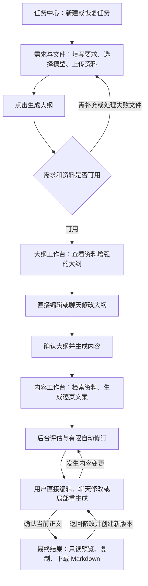

# SlideAI 开发指导（Implementation Plan）

> 版本：2.0｜日期：2026-09-29｜用途：指导低等级模型按小任务开发、验证并交付首期代码。
>
> **执行模型须知：**有技能环境时使用 `superpowers:executing-plans` 逐项执行；没有该技能时按本文的任务卡和验收门槛执行。一次只处理一张任务卡，不一次性生成整个项目。

**Goal：**实现“需求与文件 → 大纲编辑与聊天 → 内容编辑与聊天 → 最终 Markdown”的可恢复单用户工作台，满足 AC-01 至 AC-28。

**Architecture：**FastAPI 模块化单体提供 API，独立 Celery Worker 执行文件和 LangGraph 长任务。PostgreSQL 保存业务真值及 checkpoint，Redis 负责投递和短期协调，Chroma 保存任务隔离的向量，共享卷保存原文件。

**Tech Stack：**Python 3.12、uv、FastAPI、Pydantic v2、SQLAlchemy async、Alembic、LangGraph 1.x、LangChain 1.x、Celery 5.x、PostgreSQL 16+、Redis、Chroma；Vue 3、TypeScript strict、Vite、Pinia、TanStack Vue Query、Element Plus、Axios、Vitest、Playwright；Docker Compose。

**Spec：**[需求分析](./需求分析.md)、[项目说明](./项目说明.md)、[前端设计](./前端设计.md)、[首期设计说明](./superpowers/specs/2026-09-28-slideai-v1-design.md)。既有[实施计划](./superpowers/plans/2026-09-28-slideai-v1.md)提供阶段参考，本文细化其执行契约。

## 0. 阅读顺序、依据与当前状态

1. 先读本文第 1 节，理解用户操作；再读《需求分析》第 6、12 节，理解功能与验收。
2. 实现前端时同时读《前端设计》对应章节，尤其第 4、7、8、16、17 节。
3. 实现每张任务卡前，只加载本文公共契约、该卡涉及的源文件和测试，不把全部任务混在一次改动里。
4. 产品范围以《需求分析》为准；已有首期设计说明中的工程默认值继续采用；本文明确接口、状态及执行顺序；视觉和固定文案以《前端设计》为准。效果图仅供参考。
5. 本文新增的规则标为“补充约定”，是为了消除实现歧义，不代表源文档已逐项规定。第 3–7 节中未被源文档固定的精确文件名、表名、字段、接口签名和新增 API，统一视为本文的补充实现契约。外部服务真实可用性须实际验证，不从文档型号推断。

**编写时的工作区事实：**当前磁盘上没有 `backend/`、`frontend/`、Compose 等实现文件；Git 中存在大量既有删除和文档修改。本文只建立开发指导，不恢复这些文件，不把旧计划里的 `[x]` 当作当前实现证据。后续开发开始前重新检查文件和 Git 状态；不要自动撤销用户删除、重置仓库或覆盖无关修改。

**已消解的歧义：**

| 原文中可能引起误解的地方 | 本文执行口径 |
| --- | --- |
| 内部节点多、效果图有六张 | 用户只有四个业务阶段、五个核心页面；不按图片数建路由 |
| 流程图把评估画在用户编辑之前或之后 | 首次生成及每次内容变更后都运行后台质量闭环，稳定后开放确认；评估不是独立人工步骤 |
| 需求分析第 13 节仍列出部分“待确认” | 首期设计已经确定的 3–50 页、85 分、最多 2 次修订等采用首期设计值 |
| “大纲人工确认”仍出现在待确认表 | FR-UI-09、AC-27 和前端固定按钮已经要求确认，必须实现 |
| 大纲确认与内容生成各有 API | 正常按钮使用一次原子确认并投递；另一个 API 不得重复启动工作流，见第 5 节 |
| 最终结果只读但有返回修改、历史撤销 | 所有内容变更回内容工作台形成新版本；已确认快照不被覆盖 |

## 1. 系统用户使用流程

### 1.1 正常路径



| 用户步骤 | 用户实际操作 | 系统必须做什么 | 进入下一阶段的条件 |
| --- | --- | --- | --- |
| 1. 新建/恢复 | 在任务中心新建，或打开已有任务 | 按服务器状态恢复正确页面，不重新创建任务 | 获得任务 ID |
| 2. 需求与文件 | 填写主题、3–50 页、场景、受众、风格，选填限制；选择自动/手动模型；可上传 PDF/DOCX/MD/TXT | 保存草稿、逐文件展示解析状态；同一份资料后续复用 | 必填字段合法，失败文件已处理 |
| 3. 生成大纲 | 点击“生成大纲” | 初步选模、解析需求、等待有效资料索引、更新复杂度、主题级检索、生成大纲 | 有冲突则回原表单内联补充，否则进入大纲工作台 |
| 4. 修改和确认大纲 | 改章节/条目/顺序/页数，或说“把第四点改成具体项目分析” | 明确目标后真实更新结构；歧义先追问；校验页数总和 | 点击“确认大纲并生成内容” |
| 5. 生成与修改正文 | 在内容工作台查看进度；完成后直接编辑、聊天修改或选择重生成范围 | 按页面目标重新检索，分批写作，后台评估及最多 2 次自动修订；保存版本、引用、模型和 Token 记录 | 后台运行已结束；用户检查当前版本 |
| 6. 确认与导出 | 点击“确认内容并查看最终结果”，预览、复制或下载 `.md` | 冻结本次确认的内容，确定性生成 Markdown | 最终结果只读，确认快照与导出一致 |
| 7. 继续修改（可选） | 从最终结果返回内容工作台 | 确认后创建新的可编辑版本，保留旧的确认快照 | 后续编辑和确认仍走步骤 5、6 |

Token 汇总、调用详情和实际模型在任务上下文中随时可查，不新增用户流程阶段。无资料时允许继续，必须说明没有使用上传资料，不伪造引用。

### 1.2 必须可用的异常路径

- **文件失败：**显示具体文件及原因；用户移除、重传或明确忽略后继续，不能悄悄丢弃文件。
- **模型暂时不可用：**有限重试、按配置备用链降级；失败节点可恢复，已经完成的内容保留。
- **大纲影响已有正文：**先列出受影响页，提供“暂不生成”或“重新生成相关页面”；只修改范围内内容。
- **自动修订达到上限：**停止后台循环，留在内容工作台，允许继续编辑、聊天、局部重生成或确认当前版本。
- **刷新或服务重启：**从数据库和 checkpoint 恢复任务、对话、变更确认卡及进度，不依赖浏览器内存。
- **并发保存：**返回版本冲突并保留用户草稿，不静默覆盖服务器新版本。

## 2. Global Constraints：全局实现约束

### 2.1 范围与开发方式

- 只交付结构化文字和 Markdown，不实现 PPTX、画布、缩略图、模板、互联网搜索、多租户或计费。
- 所有服务启动、依赖安装、迁移、lint、类型检查、测试、构建均在 Docker 容器内运行；宿主机只要求 Docker Engine 和 Compose。
- 前后端使用真实 API 闭环；Fake 模型仅用于测试或明确标注的演示模式，禁止静默回退 Fake 并声称真实模型调用成功。
- API 路由不写模型提示词、检索算法或工作流主逻辑；Vue View 不集中实现请求、轮询和业务状态机。
- `task_id` 必须进入所有子资源查询条件及向量过滤；UUID 难猜不等于隔离。
- 外部 LLM 输出必须经过结构校验和业务校验，不能直接进入正式状态。
- 文档统一保存在 `docs/`。依赖使用锁文件；具体补丁版本在工程搭建时按实际兼容性验证并锁定。
- `.env` 仅保存 API Key、数据库密码等敏感值；非敏感设置使用版本化配置文件，禁止把服务地址和模型 ID 塞入 `.env`。

### 2.2 首期已有默认值

| 项目 | 默认值/约束 | 来源 |
| --- | --- | --- |
| 主题/特殊限制 | 主题 1–200 字；限制最多 500 字 | 前端设计 §8.2 |
| 目标页数 | 3–50 页，整数；每页 2–6 条要点 | 首期设计“数据与业务规则” |
| 文件 | PDF、DOCX、Markdown、TXT；20 MiB/文件，10 个/任务 | 首期设计 |
| 提取文本 | 每文件最多 2,000,000 字符；扫描 PDF 不做 OCR | 首期设计 |
| 分块与检索 | 默认 800 token/块、重叠 120；逐页 top 6 | 首期设计 |
| Writer 批次 | 按章节分批，每批最多 5 页 | 既有实施计划 Task 5 |
| 评估 | 四维度各 25%；总分 ≥85 且无阻塞硬规则失败为通过 | 首期设计 |
| 自动修订 | 每次内容操作最多 2 轮；计数持久化 | 首期设计；计数作用域为本文补充约定 |
| 模型重试 | 每个实际模型最多重试 2 次，即首次调用加 2 次重试 | 首期设计及 AC-22 |
| 格式修复 | 一次结构化输出格式修复，仍失败则停止 | 首期设计 |
| 高影响变更 | 影响 >30% 页面、跨章节或改变关键结构/页数 | 首期设计 |
| 任务列表 | 默认每页 20，API 上限 100，前端每页 20 | 首期设计、前端设计 |
| 轮询 | 运行中可见页 2 秒，不可见页 10 秒；等待/终态停止 | 前端设计 §8.4 |
| 数据保留 | 显式删除前保留；运行中的任务不能直接删除 | 首期设计 |

### 2.3 Review Focus：贯穿开发的高风险验收

| 风险输入/事件 | 必须保证 | 所属任务 |
| --- | --- | --- |
| 替换为其他任务的页面、文件、片段 ID | 返回 404 或明确拒绝，不读取或修改外部资源 | T03、T06、T07、T10、T12 |
| 重复请求、重复队列消息、提交后进程崩溃 | 不丢任务、不重复业务提交或 Token 累计 | T03、T04、T05、T13 |
| 超大/恶意文件、路径穿越、解压膨胀 | 存储路径安全，解析有资源上限，错误可理解 | T06 |
| 非法 JSON、假引用、资料内提示注入 | 不污染正式状态，不执行资料中的指令或任意工具 | T04、T07、T10 |
| 旧 Worker 或旧浏览器在新版本之后提交 | 拒绝旧结果，保留新内容与用户草稿 | T03、T08、T11、T13 |

## 3. 工程结构与模块职责

下列路径是待创建的目标结构，不表示文件已经存在。任务卡出现的其他文件在对应阶段创建；禁止预先生成大量空壳模块。

```text
SlideAI/
├─ docker-compose.yml
├─ .env.example
├─ .github/workflows/ci.yml
├─ backend/
│  ├─ Dockerfile
│  ├─ pyproject.toml / uv.lock / alembic.ini
│  ├─ config/app.yaml / models.yaml / models.example.yaml / embedding.yaml
│  ├─ migrations/versions/
│  ├─ src/slideai/
│  │  ├─ core/                 # 配置、日志、统一错误
│  │  ├─ domain/               # 类型、状态迁移、规则；不访问网络
│  │  ├─ application/
│  │  │  ├─ tasks/ files/ requirements/ outlines/
│  │  │  ├─ content/ evaluation/ chat/ workflows/
│  │  │  └─ models/            # 统一模型接口、路由、工厂、service、Token
│  │  ├─ infrastructure/
│  │  │  ├─ db/                # ORM、仓储、事务
│  │  │  ├─ documents/ files/ vector/
│  │  │  ├─ redis/ celery_queue/
│  │  │  └─ recovery/          # 持久化回执、补偿
│  │  ├─ workflow/             # State、Graph、节点与恢复
│  │  ├─ workers/              # Celery 入口、outbox 投递、补偿执行
│  │  └─ api/v1/               # HTTP 请求/响应适配
│  └─ tests/unit/ integration/ contract/
├─ frontend/
│  ├─ Dockerfile / package.json / pnpm-lock.yaml
│  ├─ src/
│  │  ├─ layouts/AppShell.vue
│  │  ├─ views/                # 仅五个 View，名称见第 10 节
│  │  ├─ components/           # 按前端设计 §15 分组
│  │  ├─ api/ types/ stores/ composables/ styles/
│  │  └─ domain/task-routing.ts
│  └─ tests/
├─ e2e/Dockerfile / package.json / playwright.config.ts / tests/
└─ docs/
```

依赖方向：`api/workers → application → domain`；application 通过接口访问 infrastructure；workflow 节点调用 application 服务，不能绕过服务直接改数据库。统一模型 service 的文件位置沿用《需求分析》§6.10；厂商协议细节封装在各 service 内，不能复制到 Agent。

| 存储 | 唯一职责 | 不允许的替代做法 |
| --- | --- | --- |
| PostgreSQL | 任务、内容、修订、聊天、调用记录、outbox、业务版本、checkpoint | 用 Redis/Pinia 替代任务持久化 |
| Redis | Celery broker/result、可续租锁、短期协调 | 把 Redis 当唯一任务状态源 |
| Chroma | 带 task_id 的向量索引 | 用向量库保存唯一原文或跨任务搜索 |
| 共享文件卷 | UUID 原文件、必要的持久化恢复回执 | 使用原始文件名拼路径或 API/Worker 各存各的 |

## 4. 数据与版本契约

### 4.1 统一命名和聚合

Python/API 字段统一 `snake_case`，ID 为 UUID 字符串，时间为带时区的 UTC ISO 8601；UI 按用户时区展示。`page_num` 只作为模型原始输出兼容字段，正式业务统一 `target_page_count`，不要同时维护两个页数字段。

| 对象/建议表 | 必需字段与含义 |
| --- | --- |
| `generation_tasks` | id、status、stage、current_node、raw_requirement、structured_requirement、model_preference、task_complexity、version、outline_version、content_version、confirmed_outline_version、confirmed_content_version、active_run_id、run_epoch、error、created_at、updated_at |
| `source_files` | id、task_id、original_name、storage_key、media_type、size_bytes、status、ignored、content_hash、error；状态 `UPLOADED/PARSING/CHUNKING/EMBEDDING/READY/FAILED/DELETED` |
| `document_chunks` | id、task_id、file_id、text、location、embedding_version、vector_id；location 存 PDF 页码、DOCX 段落/标题或文本行号 |
| `outlines` | task_id、version、sections；章节及条目均有稳定 id、title、goal、order；条目有 page_count、source_chunk_ids |
| `slides` | id、task_id、section_id、item_id、page_number、title、bullets、speaker_notes、citations、verification_notes、based_on_outline_version、stale、version |
| `evaluations` | id、task_id、content_version、operation_id、dimension_scores、total_score、passed、hard_issues、issues、suggestions |
| `revisions` | id、task_id、source、scope_ids、before_snapshot、after_snapshot、base_version、result_version、operation_id、summary、created_at |
| `confirmed_results` | id、task_id、content_version、outline_version、requirement_snapshot、outline_snapshot、slides_snapshot、markdown、confirmed_at；不可变 |
| `chat_messages` / `change_requests` | task_id、稳定消息 ID、role、text、context、change_id；变更含目标、操作、影响、基准版本、确认状态及执行结果 |
| `model_calls` | id、task_id、run_id、operation_id、node、purpose、logical_call_id、attempt_no、requested_model、actual_model、provider、route_reason、fallback_reason、provider_request_id、status、error_code、usage_status、各 Token 字段、耗时 |
| `workflow_runs` / `node_runs` | run_id、task_id、operation_id、run_epoch、节点/批次幂等键、输入版本、结果引用、状态、取消标记 |
| `outbox_events` | id、task_id、event_type、payload、idempotency_key、status、attempts、next_attempt_at、published_at |

数据库约束至少包括 `(task_id, page_number)` 唯一、`(logical_call_id, attempt_no)` 唯一、节点幂等键唯一；子资源外键/复合约束必须保证任务归属。页码是排序结果，不能用页码替代稳定页面 ID。

任务 Token 汇总首期从调用事实表聚合；需要缓存时再建汇总表，调用事实表始终是计量真值。正式业务表和 checkpoint 可使用不同 schema，但共同由 PostgreSQL 持久化，不用内存 checkpointer 验收重启恢复。

### 4.2 关键结构

```text
ModelPreference = { mode: "auto" | "manual", preferred_model_key: string | null }
StructuredRequirement = {
  topic, target_page_count, scenario, audience, style,
  constraints: string[], language, source_preference, raw_description
}
TaskSnapshot = {
  id, status, stage: "requirement" | "outline" | "content" | "result",
  current_node, version, outline_version, content_version,
  allowed_actions: string[], progress: { completed_pages, total_pages },
  active_run_id, pending_change_ids: string[], error
}
ChangeRequest = {
  id, task_id, stage: "outline" | "content", intent,
  target_ids: string[], operations: object[], affected_page_ids: string[],
  expected_task_version: int, needs_confirmation: bool,
  status: "NEEDS_CLARIFICATION" | "AWAITING_CONFIRMATION" | "QUEUED" |
          "APPLIED" | "REJECTED" | "FAILED",
  regeneration_choice: "defer" | "regenerate_affected" | null
}
Citation = { chunk_id, file_id, location }
```

所有 object 最终必须用 Pydantic/TypeScript 判别联合定义，禁止把 `operations` 留为可执行任意 JSON。只允许预定义的 `rename_item/reorder_items/set_page_count/replace_slide_fields` 等操作；验证目标 ID 和许可字段后执行。

### 4.3 版本和快照规则（补充约定）

1. `task.version` 从 1 开始，是所有业务修改的乐观锁；大纲、内容版本分别在对应内容变化时递增。内部日志/Token 写入不递增业务版本，避免轮询期间无意义冲突。
2. 普通编辑请求传 `expected_version`，它始终指 task.version；聊天与变更确认按既有设计使用 `expected_task_version`，语义相同。不得误传页面版本或内容版本。
3. 一个事务完成版本比较、对象写入、修订快照、状态更新及 outbox 插入；若版本过时返回 409，不调用模型后才检查已知冲突。
4. 长任务记录输入版本、run_id、run_epoch；每次提交结果重新核验，旧运行不能写入新版本。Redis 锁失效也不能破坏此规则。
5. 直接编辑、聊天、局部重生成和后台修订均保存修订来源、前后快照及范围。范围外页面的 ID、正文和引用必须不变。
6. 正文确认固定本次需求、大纲和内容快照及 Markdown；确认后修改先执行 reopen 创建新工作版本。查看旧确认版本与导出旧版本可通过 result_id 显式选择。
7. 修改生成后的大纲并选择“暂不生成”时，记录受影响页面 `stale=true`，撤销该大纲的确认标记；保留旧正文。再次确认大纲后只重生成受影响页，或由用户手动同步并显式确认；存在 stale 页时不能确认最终正文。
8. 撤销只允许最近一次未被后续内容修改覆盖的用户/聊天修订。撤销写入新的修订和递增版本，不回拨版本号；`can_undo` 由后端计算。

## 5. API 合同

### 5.1 公共规则

所有业务路径前缀 `/api/v1`。下表 `{id}` 均为 task_id；需求文档的 `/tasks/{taskId}/token-usage` 对应完整路径 `/api/v1/tasks/{id}/token-usage`。

- 同步创建返回 201；读取/保存返回 200；异步操作返回 202 及 `{task_id, run_id, status, version}`；同步无响应体删除返回 204，需异步清理的任务删除返回 202。
- 所有可能重复创建/投递的 POST 要求 `Idempotency-Key`。幂等域为接口＋task_id＋key，保存请求哈希；相同请求回放原结果，不同请求复用 key 返回 409 `IDEMPOTENCY_CONFLICT`。
- 列表返回 `{items, page, page_size, total}`。输入不合法返回 422；资源不属于任务返回 404；版本/状态冲突返回 409；禁止把所有错误转成 500。
- 统一错误：`{error:{code,message,details,request_id}}`。message 可直接展示，details 不带堆栈、密钥、完整 prompt 或原始厂商响应。
- `allowed_actions` 由后端状态与版本计算；前端据此展示，后端必须再次校验，不能依赖按钮禁用保护状态。

### 5.2 路径、输入和副作用

| 方法与路径 | 核心输入/输出 | 状态与副作用 |
| --- | --- | --- |
| `GET /models` | 目录：key、display_name、tier、available、unavailable_reason | 只暴露 UI 所需信息，不返回密钥/API URL |
| `GET /tasks` | page、page_size、query、status；分页结果、筛选范围的 summary_counts、recent_activity | updated_at 降序，同时间用 id 稳定排序；统计不是当前页计数 |
| `POST /tasks` | 草稿需求、model_preference | 允许不完整草稿；创建 DRAFT，version=1 |
| `GET /tasks/{id}` | TaskSnapshot、需求、模型摘要、最新 confirmed_result_id | 刷新恢复唯一入口 |
| `PATCH /tasks/{id}` | expected_version、草稿/结构化字段/模型偏好 | 运行时拒绝；已有下游数据且需求实质变化时要求影响确认并使下游失效 |
| `DELETE /tasks/{id}` | expected_version 查询参数 | 运行中返回 TASK_BUSY；标记不可访问后异步清理，失败重试 |
| `POST /tasks/{id}/files` | multipart 文件 | 已有 task_id 后上传；流式大小校验；异步处理 |
| `GET /tasks/{id}/files` | 文件列表 | 含状态、错误、ignored，不返回服务器路径 |
| `PATCH /tasks/{id}/files/{file_id}` | expected_version、ignored | 补充接口：显式忽略失败资料；保留错误记录 |
| `POST /tasks/{id}/files/{file_id}/retry` | expected_version | 重试处理该文件，保留稳定文件 ID |
| `DELETE /tasks/{id}/files/{file_id}` | expected_version 查询参数 | 移除及安排向量/文件清理；已有引用时拒绝并返回影响范围 |
| `POST /tasks/{id}/outline/generate` | expected_version | 解析需求、等索引、检索与生成；不是前端分别调用多个 Agent |
| `GET /tasks/{id}/outline` | version、outline_version、sections、引用、影响标记 | 尚未生成时返回可识别的未就绪结果 |
| `PUT /tasks/{id}/outline` | expected_version、sections | 校验完整结构；高影响修改返回 change_id，不立即落正式大纲 |
| `POST /tasks/{id}/outline/confirm` | expected_version | 原子确认当前大纲并投递内容生成，返回 202 |
| `POST /tasks/{id}/content/generate` | expected_version、outline_version | 仅恢复“已确认但尚未调度”的同一生成意图；已有运行不重复投递 |
| `GET /tasks/{id}/slides` | version、content_version、items | 运行中可返回已提交页面；不伪造剩余页面 |
| `PUT /tasks/{id}/slides/{page_id}` | expected_version、title、bullets、speaker_notes | 保存指定页并投递该范围后台评估，返回 202；不允许借此改页数/归属 |
| `POST /tasks/{id}/regenerations` | expected_version、page_ids、feedback | 范围验证；高影响先返回确认方案，批准后投递 |
| `POST /tasks/{id}/content/confirm` | expected_version、accept_current_with_warnings | 冻结快照、生成 Markdown、进入 COMPLETED，返回 result_id |
| `POST /tasks/{id}/content/reopen` | expected_version、result_id | 补充接口：复制确认快照为新工作版本，进入内容工作台 |
| `POST /tasks/{id}/retry` | expected_version、可选 model_preference | 从失败节点恢复，同一任务，保留成功结果 |
| `POST /tasks/{id}/cancel` | expected_version | 设置取消标记和运行隔离代次；返回现场状态 |
| `GET /tasks/{id}/evaluations/latest` | 最新评估及 evaluated_content_version | 诊断用途，无评估时 200 返回 null |
| `GET /tasks/{id}/model-calls` | 分页明细 | 包含 requested/actual model、路由原因、重试/降级 |
| `GET /tasks/{id}/token-usage` | totals、by_model、by_node、calls、usage_status、is_complete | 聚合覆盖全部调用；calls 单独分页且返回分页信息 |
| `GET/POST /tasks/{id}/chat/messages` | GET 历史；POST text、stage、selected_ids、expected_task_version | 返回澄清、待确认或执行状态；长操作 202，纯澄清 200 |
| `GET /tasks/{id}/changes` | 待处理及历史变更 | 补充接口：刷新恢复确认卡 |
| `POST /tasks/{id}/changes/{change_id}/confirm` | expected_task_version、decision、regeneration_choice | 拒绝无副作用；确认再次校验基准版本，过期不能直接执行 |
| `GET /tasks/{id}/revisions` | 分页历史、can_undo | 补充接口：结果页与工作台使用同一历史 |
| `POST /tasks/{id}/revisions/{revision_id}/undo` | expected_version | 新建反向修订；COMPLETED 时先 reopen |
| `GET /tasks/{id}/markdown` | 可选 result_id；返回 markdown 与确认版本 | 无确认结果返回 409 RESULT_NOT_CONFIRMED；草稿不会混入导出 |
| `GET /tasks/{id}/markdown/download` | 可选 result_id；UTF-8 `.md` | 与预览完全同源，Content-Type 为 text/markdown |

**补充约定：**失败文件可单独忽略；READY 文件被后续版本引用后，禁止直接删除/替换以免引用失效。用户要换资料时先通过需求更新的影响确认重建大纲及相应内容；全任务删除不受历史引用阻止。草稿更新、直接大纲编辑和聊天均复用同一影响分析服务，不能靠换入口绕过确认。

大纲确认按钮只调用 `/outline/confirm`，不再紧接着调用 `/content/generate`。确认事务写入确认版本和唯一生成 outbox；后者仅是幂等恢复入口。上述补充接口填补前端已要求的返回修改、历史、忽略和恢复能力，不新增顶级页面。

### 5.3 稳定错误码

至少定义：`VALIDATION_ERROR`、`RESOURCE_NOT_FOUND`、`VERSION_CONFLICT`、`INVALID_TASK_STATE`、`TASK_BUSY`、`IDEMPOTENCY_CONFLICT`、`FILE_TOO_LARGE`、`FILE_TYPE_UNSUPPORTED`、`NO_EXTRACTABLE_TEXT`、`SOURCE_FILES_NOT_READY`、`OUTLINE_PAGE_COUNT_MISMATCH`、`STALE_CONTENT`、`CITATION_INVALID`、`MODEL_UNAVAILABLE`、`MODEL_AUTH_ERROR`、`MODEL_INPUT_ERROR`、`MODEL_OUTPUT_INVALID`、`MODEL_RETRIES_EXHAUSTED`、`RESULT_NOT_CONFIRMED`。增加错误码须同步前端映射与合同测试，不用中文 message 判断错误类型。

## 6. 状态机、LangGraph 与恢复

### 6.1 任务状态和默认路由

| 状态 | 默认页面 | 允许的关键动作/下一状态 |
| --- | --- | --- |
| DRAFT | 编辑任务 | 保存、上传；资料处理进入 FILES_PROCESSING，满足要求进入 READY |
| FILES_PROCESSING | 编辑任务 | 查看/处理文件；完成后 READY |
| READY | 编辑任务 | 生成大纲 → GENERATING_OUTLINE |
| GENERATING_OUTLINE | 大纲工作台 | 运行需求解析/索引等待/主题检索/规划；完成后 WAITING_OUTLINE_CONFIRMATION |
| WAITING_REQUIREMENT_INPUT | 编辑任务 | 内联补充并再次启动大纲流程 |
| WAITING_OUTLINE_CONFIRMATION | 大纲工作台 | 直接编辑、聊天、确认 → RETRIEVING |
| RETRIEVING | 内容工作台 | 按页面检索 → GENERATING_CONTENT |
| GENERATING_CONTENT | 内容工作台 | 分批提交内容 → OPTIMIZING_CONTENT |
| OPTIMIZING_CONTENT | 内容工作台 | 评估/最多 2 次修订 → WAITING_CONTENT_CONFIRMATION |
| WAITING_CONTENT_CONFIRMATION | 内容工作台 | 编辑/聊天/重生成后再评估；确认 → COMPLETED |
| COMPLETED | 最终结果 | 查看/下载；reopen → WAITING_CONTENT_CONFIRMATION |
| FAILED_RETRYABLE | 按保留的 stage 定位 | 重试失败节点，或调整模型后重试 |
| FAILED_FINAL | 按保留的 stage 定位 | 查看错误/返回任务中心；不能盲目重试 |
| CANCELLED | 按保留的 stage 定位 | 只读现场/删除/新建任务 |

补充约定：大纲请求已经受理后，即便仍等待文件索引，外层状态保持 GENERATING_OUTLINE，在 current_node 显示文件等待，避免前端在两个页面间跳动。未提交大纲请求时文件处理状态才映射 FILES_PROCESSING。缺失必填条件不可伪装为 READY。

失败和取消保留 stage，不用“是否有 slides”猜测所在页面。当前状态可恢复动作由服务器返回，后端用显式迁移表拒绝不合法操作。

### 6.2 工作流实现顺序

```text
preflight / initial_route
  → requirement
  → [缺失/冲突：interrupt，等待原表单补充]
  → await_files → outline_retrieve → planner
  → interrupt：等待大纲确认
  → retrieve → write（每批最多 5 页，已完成批次可跳过）
  → hard_checks → evaluate
  → [不通过且 revision_count < 2：refine → 范围写入 → hard_checks → evaluate]
  → interrupt：等待内容操作或正文确认
  → markdown → completed
```

- `thread_id=str(task_id)`；使用持久化 PostgreSQL checkpointer。恢复传入已校验的 Command/resume 数据，不从 START 重跑。
- `SlideState` 保存 requirement、outline、slides 等结果引用/必要快照，以及 task_id、run_id、operation_id、input_version、revision_count、pending_change、model_preference、task_complexity、error。大文件全文和完整历史不塞进每个 checkpoint。
- 模型调用前先选择模型；Requirement 不能先调用再声称完成初次路由。解析后更新复杂度供后续节点使用。
- 节点输入输出采用明确类型。Supervisor 用确定性条件控制流转，不用自由文本决定数据库写入或任意工具调用。
- interrupt 前的副作用必须幂等；LangGraph 恢复可能重入节点，不能仅因进入节点就重新扣计调用/写修订。

### 6.3 后台评估与用户编辑的串行规则

同一任务只允许一个活动内容操作。正在检索、生成、评估或自动修订时，已完成内容可浏览，直接保存、聊天执行、正文确认均禁用，服务端同样拒绝。进入 WAITING_CONTENT_CONFIRMATION 后开放编辑。

直接编辑/聊天完成即保存一个版本并启动该范围评估；评分不通过时 Refiner 只能修改批准范围。每次用户新操作建立新的 operation_id 和 revision_count=0；因异常恢复、队列重投或刷新不能重置计数。自动修订本身不能创建新的操作预算。

达到 2 次后允许接受低分内容，`accept_current_with_warnings=true` 记录用户选择。正文仍须满足可导出的结构条件：页数正确、页码连续、必需字段合法、引用合法、无 stale 页。质量偏好未满足可接受，结构损坏不可伪装成完成。

### 6.4 投递、取消与故障一致性

1. API 事务写业务变更与 outbox；事务成功后由独立 dispatcher 投递 Celery。dispatcher 是 worker 服务中被进程管理器管理的独立循环，直接读取 PostgreSQL，不依赖先成功投递一条 Celery 消息才能工作。
2. 队列采用至少一次投递；消费者按事件 ID、节点/批次幂等键读取持久化执行记录。投递成功但 published 标记失败时重复消息也不能重复业务提交。
3. Redis 锁带随机持有者标识、租期、续租和按标识释放；数据库 run_epoch 提供最终隔离。旧 Worker 失去锁或遇到取消后不能提交结果。
4. 取消在节点/批次边界协作生效。已发出的外部请求不保证能撤销，但其调用记录和返回 usage 仍需保存；取消后的正文结果不再应用。
5. Worker 重启通过 checkpoint 和节点执行记录恢复；已完成批次保留。外部供应商不支持幂等时，“请求成功但回执丢失”无法保证恰好调用一次：原尝试记未知用量，新请求记新 attempt，不宣称零重复费用。
6. 文件、Chroma、数据库不是跨系统原子事务。失败记录补偿事件；READY 只在解析、片段和向量全部可用后设置。清理事件带资源 ID，重复执行安全。

## 7. 模型工厂、路由与 Token 计量

### 7.1 组件和固定接口

实现以下文件，不允许把功能合并进 `workflow/graph.py`：

| 文件（相对 `backend/src/slideai/`） | 接口与职责 |
| --- | --- |
| `application/models/llm_service.py` | `LLMService.invoke_structured(*, task_id, node, purpose, model_id, messages, output_schema, idempotency_key) -> ModelResult[T]`；定义统一请求、结果、usage 和错误类型 |
| `application/models/factory.py` | `LLMServiceFactory.create(provider: str) -> LLMService`；只负责选择 service，不判断复杂度 |
| `application/models/deepseek_service.py` | `DeepSeekService`；执行一次真实厂商请求，归一化 response/error/usage；同一类支持目录中的两款 DeepSeek |
| `application/models/glm_service.py` | `GLMService`；执行一次真实厂商请求，归一化 response/error/usage；同一类支持目录中的两款 GLM |
| `application/models/router.py` | `ModelRouter.select(context: RoutingContext) -> RoutePlan`；纯规则选首选与兼容备用链 |
| `application/models/gateway.py` | `ModelGateway.generate(request: GenerationRequest, output_schema: type[T]) -> T`；统一协调重试、工厂、调用记录、校验和一次格式修复 |
| `application/models/token_usage_service.py` | `start_attempt(context) -> CallAttempt`、`finish_attempt(call_id, outcome) -> None`、`summarize(task_id, page, page_size) -> TokenUsageSummary` |
| `domain/models/catalog.py` | `ModelConfig`、`RoutePlan`、`RoutingContext`、`GenerationRequest`、模型目录校验 |
| `domain/tasks/complexity.py` | `score_complexity(features, rules) -> ComplexityResult`，保存分值、档位和原因 |
| `tests/fakes/llm_service.py` | 按 fixture 队列输出固定成功/失败/usage，能指定第几次调用出错；不混入生产路由 |

上述涉及 I/O 的接口实现为 async；Router、Factory 和复杂度计算为同步。`ModelResult[T]` 包含 parsed/raw_response 引用、normalized_usage、provider_request_id；原始内容只在受控内存/恢复存储内处理，不返回前端。结构验证失败的统一异常也携带本次 usage，不能因为 JSON 错误丢掉计量。

统一类型的最小字段固定如下，由 `catalog.py` 与 `llm_service.py` 分别定义并导出，不在节点重复声明：

```text
RoutingContext = { task_id, node, purpose, model_preference, task_complexity,
                   estimated_input_tokens, required_output_tokens }
RoutePlan = { preferred_model_key, fallback_model_keys: string[], reason,
              max_retries_per_model: int }
GenerationRequest = { task_id, run_id, operation_id, logical_call_id,
                      node, purpose, messages: Message[], routing: RoutingContext }
Message = { role: "system" | "user" | "assistant", content: string }
ModelResult[T] = { parsed: T, raw_response: string, normalized_usage: Usage,
                   provider_request_id: string | null }
Usage = { input_tokens: int | null, output_tokens: int | null,
          total_tokens: int | null, cached_input_tokens: int | null,
          reasoning_tokens: int | null, usage_status }
```

Provider service 的 idempotency_key 使用本次 call_id；逻辑调用 ID 与实际尝试 ID 不能混用。当 HTTP 已发出但结果未知时，新的实际调用必须使用新的尝试 ID。

完整调用链：`节点 → Gateway（调用 Router）→ Factory → 厂商 Service → API`。Service 不隐式重试，关闭 SDK 自带重试或把每次真实请求接入同一 recorder，防止“表面一次、实际多次”的漏计。模型失败由 Gateway 按 RoutePlan 处理，节点不能再套一层无限 retry。

### 7.2 配置内容和路由规则

`backend/config/models.yaml` 必须包含以下四条目录记录。初始 API ID 来自《需求分析》§6.10，本文没有验证供应商实时可用性；联调时核对实际服务地址、权限和型号，只调整配置。

| 稳定内部 key（补充） | display_name | provider | 初始 api_model_id |
| --- | --- | --- | --- |
| `deepseek_flash` | DeepSeek Flash | deepseek | deepseek-flash |
| `deepseek_pro` | DeepSeek Pro | deepseek | deepseek-v4-pro |
| `glm_47_flash` | GLM-4.7-Flash | glm | glm-4.7-flash |
| `glm_53_flash` | GLM-5.3-Flash | glm | glm-5.3-flash |

每条还需配置 `base_url`、`api_key_env`、`enabled`、`capability_tier`、`context_window`、`timeout_seconds`、`fallback_keys`。目录全局配置节点最低能力、复杂度档位映射、max_retries=2、退避上限。只返回 public catalog 给前端。

补充默认规则集中放在配置中，不能硬编码在节点内：

- 复杂度分值为五项相加：页数 ≤10/11–25/>25 对应 0/1/2；资料已提取字符 ≤20,000/20,001–100,000/>100,000 对应 0/1/2；限制数量 0–1/2–4/≥5 对应 0/1/2；专业程度 general/professional/expert 对应 0/1/2；分析深度 summary/comparison/synthesis 对应 0/1/2。
- 0–3 为 simple，4–6 为 normal，7–10 为 complex。测试覆盖边界 3/4、6/7；专业程度和深度由 Requirement 结构化返回并校验枚举，初次暂用 general/summary 并标明 provisional。
- 尚无提取字符数时，资料初值按上传总量 ≤1 MiB/>1–5 MiB/>5 MiB 对应 0/1/2；这是元数据估计，解析完成后重新计算，不将文件字节数冒充文本字符数。
- 初始自动映射建议 simple→deepseek_flash、normal→glm_47_flash、complex→glm_53_flash；节点最低档只约束自动选择及备用兼容性。此映射是配置默认值，不是不可修改的业务逻辑。
- 手动模式始终以 preferred_model_key 为首选，不偷偷按复杂度替换；若已知无法满足上下文或节点能力，返回明确不可用原因让用户处理。
- 初始备用链可配置为 glm_53_flash→deepseek_pro、glm_47_flash→deepseek_flash；DeepSeek 两条初始备用列表可为空。启动校验所有引用有效、无循环、不重复、能力及上下文兼容；失败后不递归展开备用模型自己的备用链。
- 超时、网络、429 和暂时性 5xx 可重试；每模型首次＋最多 2 次重试，随后进入有限备用列表。401/403、参数错误和输出格式错误不走整条故障降级链。
- 总调用上限由“首选及备用去重数量 × 每模型最多 3 次”限制；另最多一次格式修复请求，修复内部也遵守同一有限传输重试策略，不能再次触发格式修复。

`models.example.yaml` 只给配置结构和空/占位的服务地址；真实模式遇占位配置明确报错。`.env.example` 只含空密钥变量；`app.yaml` 保存部署、CORS、文件和业务限额；`embedding.yaml` 独立保存 Embedding provider、模型 ID、维度、版本和 tokenizer，不复用聊天模型名称猜向量模型。

### 7.3 每次实际请求的计量流程

1. 发请求前创建稳定 `call_id` 和 `(logical_call_id, attempt_no)`，持久化 STARTED；写入失败则不发外部请求。一个业务节点可有多个 logical_call，例如各页批次、评估、格式修复。
2. 每次实际重试、降级、格式修复、Embedding（包括查询向量化）都创建独立尝试。缓存命中且未发 API 请求，不造一个有 Token 的调用。
3. 厂商返回结果或错误后，优先保存业务结果回执及 usage，再幂等更新调用事实表。失败但返回 usage 的尝试也计量；未返回的字段存 null。
4. `input_tokens/output_tokens/total_tokens` 为供应商实际计量。缓存输入通常是输入的子集、推理可能是输出的子集，不能额外相加；归一化规则由厂商适配器及 fixture 测试规定。
5. `usage_status` 使用 `pending/complete/partial/unavailable`：三项主计量已知则 complete；部分已知为 partial；完全未返回为 unavailable。厂商不支持的可选缓存/推理字段为 null，不因此把已完整主计量判错；Embedding 明确不产生输出时可规范化 output=0，但依据须在适配器测试中说明。
6. 汇总按 task_id 累计已知值，同时返回缺失数。存在 pending/partial/unavailable 调用时 `is_complete=false`；已有调用但某指标全未知时 totals 对应项为 null，而不是 0。没有任何调用时三项主计量总量为 0，`is_complete=true`。
7. 用 call_id 保证相同尝试重复写入不累加；同一 `(provider, provider_request_id)` 在已知非空且厂商承诺唯一的范围内做去重约束。不能把不同真实尝试因为内容相同而合并。
8. 数据库在响应返回后故障时，将调用 ID、规范化用量、必要业务结果写到共享恢复卷的原子回执文件，限制访问权限；恢复后补偿入库再清理。回执不写密钥，业务结果与日志隔离。如果数据库和回执存储均故障，明确标记运行失败/计量待核对，不能声称能保证恢复未落盘的数据。

任务汇总必须覆盖 Requirement、Planner、Writer、Evaluator、Refiner、聊天、格式修复、文档及查询 Embedding。`calls` 分页不能影响 totals/by_model/by_node 全量聚合。原始调用记录不可因为某节点失败而删除。

**固定验收样例：**首选模型失败三次（首次＋两次重试），备用首次成功，恰好四条尝试。fixture 的 total_tokens 为 10、20、30、40 时，任务 total_tokens=100；同一回执再写一次仍为 100。第三条 usage 全缺失时，已知 total_tokens=70、缺失调用数=1、is_complete=false，不能宣称全部只用了 70。

## 8. 文档处理与任务级 RAG

### 8.1 文件流水线

`FileService.upload(task_id, stream, metadata) → FileRecord`；文件落盘后通过 outbox 执行 `process_file(task_id, file_id)`。先检验任务与状态，再逐项执行：

1. 流式读取并限制 20 MiB，不能先把任意大文件全部读入内存。
2. 检查扩展名、内容特征、可解析性；浏览器 MIME 仅为线索，TXT/Markdown 不伪造二进制签名检查。DOCX 检查 ZIP 内部结构及解压资源限额，明确拒绝旧 DOC。
3. 存储键使用 task UUID/file UUID；原名仅作显示。拒绝路径穿越，确认最终路径位于共享存储根目录内。
4. PDF 用 PyMuPDF，DOCX 用 python-docx；文本使用明确编码处理并记录解码失败。只含图片的 PDF 返回 NO_EXTRACTABLE_TEXT，不悄悄假装 OCR 完成。
5. 按标题/段落/句子切块；800/120 均为 token，使用配置 tokenizer。超长单句再按 token 切分；保存真实来源位置。
6. 调 EmbeddingGateway 并记录每次调用；按 `slideai_chunks_d{dimensions}_{version}` 选择集合，维度或版本改变必须重建，不混存。
7. 片段和索引完成后设 READY；重复执行使用稳定 chunk/vector ID 幂等 upsert。部分失败留在 FAILED，可重试/清理。

补充可配置保护值：解析单文件超时 60 秒；DOCX 总解压数据上限 100 MiB、成员数上限 10,000。在受资源约束的子进程处理解析，超时终止该解析任务，不杀整个 API。

### 8.2 检索接口与引用

```text
EmbeddingGateway.embed(task_id, node, purpose, texts: list[str]) -> list[list[float]]
VectorStore.search(task_id, query_vector, file_ids, top_k) -> list[RetrievedChunk]
RetrievalService.for_outline(task_id, requirement) -> list[RetrievedChunk]
RetrievalService.for_pages(task_id, outline, page_ids) -> dict[page_id, list[RetrievedChunk]]
```

- 数据库与 Chroma 检索均要求 task_id；file_ids 先验证同属任务且 READY、未 ignored。不给 task_id 的检索接口不提供默认全库行为。
- 大纲按主题/结构目标检索，补充默认 top 6；正文按章节和每页目标检索 top 6。两阶段使用同一索引，不要求重复上传。
- 检索空结果正常返回空数组；向量服务失败应报错，不能把服务故障伪装为“无相关资料”。
- 提供给模型的片段带允许引用的 chunk_id；输出引用必须属于本次检索集合且仍属于当前任务。Unknown chunk ID 拒绝写入，不能事后模糊匹配补一个来源。
- 引用展示为文件名＋页码/段落/行号；来源定位来自解析器，不让模型自行编造。
- 没有资料时使用需求和模型知识生成，明确无上传资料引用；无法支撑的事实可写 `verification_notes`，不输出虚构来源。
- 上传资料及聊天原文都是不可信输入。固定系统约束、有限工具白名单、任务过滤和输出校验不能被资料中的指令修改。

### 8.3 大纲页数和 Writer 规则

大纲采用章节→条目两级结构，页数存于叶子条目，章节页数由叶子求和。所有叶子至少 1 页，总和必须等于 target_page_count。章节调整总页数时：先为每个条目分配 1 页，再按原剩余页数比例分配剩余值，采用最大余数法、相同余数按条目顺序分配；原剩余页数总和为 0 时按等权分配。小于条目数、空条目列表或原页数含非正整数直接报错。规则为补充约定，前后端共用测试样例，不各写随机分配。

在 `backend/src/slideai/domain/outlines/allocation.py` 定义纯函数 `allocate_item_pages(original_counts: list[int], target_total: int) -> list[int]`，无效输入抛出 ValueError，由应用层映射为 422。T08 至少实现以下可直接运行的断言；前端只做同规则即时预览，服务器计算结果为准：

```python
import pytest
from slideai.domain.outlines.allocation import allocate_item_pages

def test_allocate_pages_uses_stable_order_for_ties():
    assert allocate_item_pages([2, 2], 5) == [3, 2]
    assert allocate_item_pages([1, 1, 1], 5) == [2, 2, 1]
    assert allocate_item_pages([3, 1], 6) == [5, 1]

def test_allocate_pages_never_discards_an_item():
    with pytest.raises(ValueError):
        allocate_item_pages([1, 1, 1], 2)
```

Writer 根据确认大纲预先生成稳定页面 ID 和连续 page_number；一批不得跨越不相邻目标页。模型只填约定页面字段，不得自行新增页。分批保存时验证恰好返回本批目标、标题非空、2–6 条非空要点、引用合法。失败只重试失败批次，保留其他批次内容和 ID。

## 9. 聊天、范围变更和质量闭环

### 9.1 聊天必须真正修改结构化结果

`ChatService.send(task_id, request: ChatMessageRequest) -> ChatActionResult` 输入用户文本、所在阶段、选中 ID、基准版本；输出以下判别类型之一：`answer`、`clarification`、`confirmation_required`、`execution_queued`、`applied`。

处理顺序：保存消息 → 从当前任务加载上下文 → 模型解析意图 → 确定性验证目标 ID/操作字段/影响范围 → 追问或确认 → 调用大纲/正文应用服务 → 保存修订及结果消息 → 刷新前端数据。

- “第四点”只有在当前选中对象或大纲层级可唯一解释时才修改；否则返回候选条目追问。
- 用户只是在讨论时输出 answer，不擅自修改；明确修改请求不能只给建议。
- 内容修改只改批准 page_ids；选择的目标和文本指向冲突时先澄清，不猜测优先级。
- 大范围判断：`受影响的唯一页面数 / 目标总页数 > 0.30`；跨章节或关键结构/页数变化也需确认。恰好 30% 且不触发其他规则不因比例单独要求确认。
- 已生成正文的大纲变更无论比例大小都展示影响卡。用户可拒绝整个修改，或批准后选择 defer/regenerate_affected；defer 仍保存大纲及 stale 标记。
- 等待确认时不能先改正式状态；确认时若 task.version 已变，返回 VERSION_CONFLICT，重新分析，不能使用旧影响清单继续。
- 大纲改页数需同步结构化目标页数并展示影响，仍限定 3–50；内容接口不得暗改页数。
- 消息、澄清上下文和 pending change 均入库。刷新后 GET 历史＋changes 即可恢复，不从上一条自然语言重新推断已批准内容。

### 9.2 评估及修订

`run_hard_checks(slides, requirement, outline) -> list[HardIssue]` 不调用模型，检查页数/页码/非空/要点数/结构/引用和明确要求的覆盖项。`Evaluator.evaluate(context) -> EvaluationResult` 对完整性、逻辑性、内容质量、需求符合度各给 0–100 分，取等权平均。

`passed = total_score >= 85 and no_blocking_hard_issues`。高分不能覆盖硬失败；模型评分不是事实正确性的保证。保存评估对应的 content_version，旧版本评估不得用于新版本确认。

`Refiner.refine(context, allowed_page_ids, issues) -> ScopedRevision` 只生成范围内的修订提案；Writer/统一应用器校验后提交，再重评。Refiner 已返回完整合法正文时不为凑节点再次调用 Writer；若返回修订指令，则由 Writer 执行，所有实际调用分别计量。

同一范围外内容即使被评估发现有问题，也只能提示或提出新的待确认扩大范围方案，不能后台扩大修改。修订次数与操作绑定、上限 2、异常恢复不重置，参见第 6.3 节。

## 10. 前端实现约束

### 10.1 五个页面和共享组件

| View 文件 | 路由 | 必须接通的能力 |
| --- | --- | --- |
| `TaskCenterView.vue` | `/tasks` | 真实列表、全量统计、筛选、20 条分页、状态恢复、取消/删除 |
| `TaskEditView.vue` | `/tasks/new`、`/tasks/:taskId/edit` | 必填表单、模型目录、草稿保存、上传/错误处理、内联需求澄清 |
| `OutlineEditorView.vue` | `/tasks/:taskId/outline` | 生成状态、直接编辑、页数分配、来源、大纲聊天、确认 |
| `ContentWorkspaceView.vue` | `/tasks/:taskId/content` | 检索/生成/优化状态、直接编辑、聊天、局部重生成、确认 |
| `TextResultView.vue` | `/tasks/:taskId/result` | 只读正文/Markdown 源码/修改历史、复制下载、Token、返回修改 |

实现顺序：tokens → AppShell/AppHeader → WorkflowStepper/FlowActionBar/状态组件 → 五个页面。完整组件树及视觉值直接遵守《前端设计》§5–7、15，不在本文另创第二套值。

强制共享 `AppHeader`、`TaskContextHeader`、`WorkflowStepper`、`FlowActionBar`、`TaskStatusTag`、`SourceFileList`、`ModelStatusCard`、`TokenUsageSummary`、`ChatAssistantDrawer`。流程条固定“需求与资料 / 大纲 / 内容 / 最终结果”，不得插入评估阶段。

页面只组合组件与 composable。`domain/task-routing.ts` 实现唯一 `resolveTaskRoute(task)` 和 `resolveTaskAction(task)`；服务端 allowed_actions 决定能否编辑/执行。默认恢复路由与允许访问的只读历史页面要区分，不能把用户明确返回修改需求的操作又无限重定向回大纲。

### 10.2 数据和交互闭环

- Axios client 统一 base URL、request_id 和稳定错误码；API TypeScript 类型由合同集中生成或维护，不在各组件复制。
- Vue Query 保存任务、文件、正文、对话、Token 等服务端数据，query key 含 task_id；Pinia 只保存草稿、选中项、抽屉等 UI 状态。
- Mutation 成功后按影响使对应 query 失效；内容修改同时刷新任务、正文、修订、后台评估及 Token，不手工同步多份服务端缓存。
- 新建任务先创建 task_id 再上传，重复点击保存/生成复用该任务；未填写完整允许保存草稿，正式生成前校验必填。
- 轮询按 2 秒/10 秒规则，等待状态停止；新的用户异步操作获 202 后重启轮询，不能因先前停轮询而永远不更新。多个组件共享一次任务查询。
- 主按钮固定为“生成大纲”“确认大纲并生成内容”“确认内容并查看最终结果”。确认先保存草稿，等待后台闭环稳定后确认最新版本；不得一键提交未保存旧版本。
- 409 保留未提交长文本并允许复制/恢复；禁止自动重发以覆盖新版本。离开有未保存修改的页面要统一提示。
- Markdown 用 markdown-it 渲染、默认禁原始 HTML，再经 DOMPurify；限制危险链接协议。下载和复制均使用服务器确认版本的原始 Markdown。
- 不显示伪造的总百分比或模型用量。用 `已完成 X / Y 页文字内容`；usage 缺失显示“部分调用未返回用量”。
- 响应式检查 1600/1440/1280/1024/768 宽度，聊天 <1280 使用覆盖抽屉；检查键盘操作、focus、长文件名和操作栏遮挡。

## 11. 分阶段开发任务卡

### 11.1 执行纪律与验证命令

阶段依赖固定为 `0 → 1 → 2 → 3 → 4 → 5 → 6 → 7`。阶段 4 只是可生成、编辑、确认的中间交付，阶段 5 补齐质量闭环后才能用于首期整体验收。前面阶段可以使用明确标记的占位状态，不能把未接通按钮当成功功能。

每张卡固定执行：

- [ ] 读取列出的输入契约及文件，检查前置任务是否有实际证据。
- [ ] 将卡中的行为样例写成测试，运行并观察预期失败；不能用导入错误/环境错误冒充业务失败。
- [ ] 只实现该卡接口和行为，不顺带修改其他模块。
- [ ] 运行本卡测试、相关静态检查；修复失败后记录命令、退出码和关键断言。
- [ ] 自查没有 Fake 冒充、跨任务读取、版本绕过、硬编码密钥或空实现。
- [ ] 更新 `docs/开发进度.md`，按卡记录实现/验证/阻塞状态；有提交授权时只提交本卡相关文件，禁止 `git add .` 混入用户已有删除。

以下命令是**待搭建工程须提供的接口**，本文编写阶段没有运行它们。所有命令在仓库根目录执行：

| 代号 | 命令与通过条件 |
| --- | --- |
| B | `docker compose run --rm api uv run --frozen pytest`；所选测试全部 PASS，无意外 skip |
| BS | `docker compose run --rm api uv run --frozen ruff check .`；随后 `docker compose run --rm api uv run --frozen pyright`；退出码均 0 |
| F | `docker compose run --rm frontend pnpm test -- --run`；所选组件测试 PASS |
| FS | 依次执行 `docker compose run --rm frontend pnpm lint`、`docker compose run --rm frontend pnpm typecheck`、`docker compose run --rm frontend pnpm build`；均退出 0 |
| M | `docker compose run --rm api uv run --frozen alembic upgrade head`；全新测试库迁移成功，再运行无额外变更 |
| E | `docker compose --profile test run --rm e2e pnpm test`；真实前后端＋数据库＋Worker 流程全部 PASS |

单卡测试把具体路径附加到 B/F 命令；例如 `docker compose run --rm api uv run --frozen pytest tests/unit/test_model_gateway.py`。首次工程搭建安装/锁定依赖也在容器内完成，后续使用 frozen lock。测试服务隔离数据库/卷，禁止为了测试清空开发数据。

### 阶段 0：可启动、可验证的工程基础

#### T01 工程骨架、健康检查与配置

**输入：**第 2、3 节。**产出：**API/Worker/前端入口及可重复的容器命令。

**创建文件：**`docker-compose.yml`、`backend/Dockerfile`、`frontend/Dockerfile`、`backend/pyproject.toml`、`backend/alembic.ini`、`backend/migrations/env.py`、`backend/config/app.yaml`、`backend/src/slideai/core/{config,errors,logging}.py`、`backend/src/slideai/api/{main,health}.py`、`backend/src/slideai/workers/celery_app.py`、`frontend/package.json`、`frontend/src/{main.ts,App.vue}`、`.env.example`。

**接口：**`create_app() -> FastAPI`；`GET /health/live` 不依赖存储；`GET /health/ready` 依赖未就绪返回 503；业务统一错误结构见第 5 节。Compose 服务固定 frontend/api/worker/postgres/redis/chroma；frontend 4173、api 8000，业务 API 前缀 /api/v1。

- [ ] 创建 `backend/tests/test_health.py`：依赖断开时 live=200、ready=503；统一错误含 request_id。
- [ ] 实现空库迁移、健康检查和 JSON 日志脱敏；前端调用真实 API 展示健康状态，不填固定 true。
- [ ] 为 B/BS/F/FS/M 建立容器执行入口；新增 `.github/workflows/ci.yml`，测试不需要真实密钥。
- [ ] 验证 M、健康测试及 `docker compose up -d --build` 后服务健康；记录依赖缺失时可理解的错误。

#### T02 设计令牌、应用外壳与路由入口

**输入：**前端设计 §4–7。**产出：**共享 UI 基础，后续页面必须复用。

**创建文件：**`frontend/src/styles/{tokens,element-theme,global}.css`、`frontend/src/layouts/AppShell.vue`、`frontend/src/components/app/{AppHeader,AppButton,AppPanel,AppConfirmDialog,TaskContextHeader,WorkflowStepper,FlowActionBar}.vue`、`frontend/src/router.ts`、`frontend/src/api/client.ts`、`frontend/tests/app-shell.spec.ts`。

**接口：**WorkflowStepper 只接收 currentStage/stageStates；FlowActionBar 通过属性和事件接入操作，不自行调用业务 API。

- [ ] 测试四个固定阶段、固定导航、焦点与按钮 loading/disabled 行为；根路由 `/` 跳转 `/tasks`。
- [ ] 按已有令牌实现共享组件；定义五页路由入口，未完成页明确显示未实现，不造假数据。
- [ ] 验证 F/FS；1440 和 1024 宽度检查主按钮不被裁切。

### 阶段 1：任务、模型服务和 Token

#### T03 任务聚合、版本、基础投递和任务中心

**输入：**T01、T02，第 4–6 节。**产出：**`TaskService.create/list/get/update/delete`、`TaskRepository`、`OutboxRepository`、`resolveTaskRoute`。

**创建文件：**`backend/src/slideai/domain/tasks/models.py`、`backend/src/slideai/application/tasks/service.py`、`backend/src/slideai/infrastructure/db/{task_repository,outbox_repository}.py`、`backend/src/slideai/api/v1/tasks.py`、`backend/migrations/versions/0001_tasks_runs_outbox.py`、`frontend/src/views/{TaskCenterView,TaskEditView}.vue`、`frontend/src/domain/task-routing.ts`、`frontend/src/api/tasks.ts`、`frontend/src/types/tasks.ts`。

- [ ] `backend/tests/contract/test_task_api.py`：不完整草稿可保存；新任务 version=1；非法正式输入 422；旧 expected_version 返回 409；20/100 分页边界；统计不受当前分页截断。
- [ ] `backend/tests/integration/test_outbox.py`：事务回滚不留事件，重复幂等键同请求回放、不同请求 409；运行任务不能删除。
- [ ] 实现任务与子资源约束、状态迁移入口、基础 outbox 表和仓储；所有运行入口复用，不留到最后才改成幂等投递。
- [ ] `frontend/tests/task-routing.spec.ts` 参数化覆盖第 6.1 节全部状态；列表/表单接真实 API，草稿刷新可恢复。
- [ ] 验证 M、B 对应两个测试文件、F 路由/任务中心、BS/FS。

#### T04 四模型目录、Factory、路由和受控调用

**输入：**T03、第 7.1–7.2 节。**产出：**ModelGateway、两厂商 service、ModelRouter 和四模型目录。

**创建文件：**第 7.1 节所列模型文件（Token 实现留 T05）、`backend/config/{models,models.example,embedding}.yaml`、`backend/src/slideai/api/v1/models.py`、`backend/tests/unit/{test_model_factory,test_complexity,test_model_gateway}.py`、`backend/tests/contract/test_provider_services.py`、`frontend/src/components/requirement/ModelSelector.vue`。

- [ ] 测试四条目录齐全；Factory 按 provider 返回正确 service；未知 provider 拒绝；手动首选不被自动规则替换；复杂度临界值 3/4、6/7 正确。
- [ ] 用 HTTP fixture 验证 DeepSeek/GLM 请求、错误和 usage 归一化，不只测试 Factory 的 isinstance。
- [ ] 测试 timeout 两次重试后备用成功、401 不重试、备用全失败可恢复、一次格式修复后仍坏 JSON 停止；模型响应不能直接改业务状态。
- [ ] 实现可注入 recorder 接口，先用测试 recorder；T05 接真实记录。前端从 GET /models 获取列表和禁用原因。
- [ ] 验证 B 的模型测试、ModelSelector 组件测试及 BS/FS；真实服务未验证时标注未联调。

#### T05 调用级持久化与 Token 汇总

**输入：**T03、T04、第 7.3 节。**产出：**TokenUsageService、调用 API、汇总 API、统一计量组件。

**创建文件：**`backend/src/slideai/application/models/token_usage_service.py`、`backend/src/slideai/infrastructure/db/model_call_repository.py`、`backend/src/slideai/infrastructure/recovery/call_receipts.py`、`backend/src/slideai/api/v1/model_calls.py`、`backend/src/slideai/api/v1/token_usage.py`、`backend/migrations/versions/0002_model_calls.py`、`frontend/src/components/task/{ModelStatusCard,TokenUsageSummary}.vue`。

- [ ] `backend/tests/integration/test_token_usage.py` 固定断言四次调用=100、回执重复仍=100、缺一次=已知70且不完整、A任务看不到B调用、明细分页不截断总量。
- [ ] 测试成功结果但 usage 入库失败可从回执补偿，不重复生成正文；缓存/推理子项不能再加到总量。
- [ ] 把真实 recorder 注入所有模型请求；实现无调用、缺失、部分计量和供应商有 usage 的失败请求。
- [ ] 前端展示总量与不完整提示，空值不渲染为 0；刷新可读取真实明细。
- [ ] 验证 M、B Token 测试、F Token 组件及 BS/FS。

### 阶段 2：文件和两阶段 RAG

#### T06 上传、解析、文件状态及清理

**输入：**T03、T05、第 8.1 节。**产出：**FileService、解析器、FileStorage 和异步文件任务。

**创建文件：**`backend/src/slideai/application/files/{service,validation,processor}.py`、`backend/src/slideai/infrastructure/documents/parsers.py`、`backend/src/slideai/infrastructure/files/local_storage.py`、`backend/src/slideai/workers/{file_tasks,outbox_tasks}.py`、`backend/src/slideai/api/v1/files.py`、`backend/migrations/versions/0003_files_chunks.py`、`frontend/src/components/source/{SourceFileUploader,SourceFileList,SourceFileRow}.vue`。

- [ ] `backend/tests/unit/test_document_parsers.py`：四种格式提取与定位；扫描 PDF 精确错误；损坏 DOCX 失败；超长文本截断不得静默成功。
- [ ] `backend/tests/contract/test_file_api.py`：20 MiB 边界、11 个文件拒绝、路径穿越、跨任务删除、忽略失败文件、运行期间修改限制。
- [ ] 实现上传→outbox→worker→解析；资源限额、超时和重复删除补偿。资料 READY 必须等 T07 向量步骤完成。
- [ ] 前端逐项显示错误、重传/移除/忽略，不要求用户重新填写需求。
- [ ] 验证 B 解析/API、F 文件组件及 BS/FS。

#### T07 分块、Embedding、检索与引用

**输入：**T04–T06、第 8.2–8.3 节。**产出：**EmbeddingGateway、VectorStore、RetrievalService。

**创建文件：**`backend/src/slideai/infrastructure/documents/chunking.py`、`backend/src/slideai/application/files/{embedding,retrieval}.py`、`backend/src/slideai/infrastructure/vector/chroma_store.py`、`backend/tests/unit/test_document_retrieval.py`、`backend/tests/integration/test_vector_search.py`。

- [ ] 测试 800/120 token 分块边界、位置保留、同维度版本集合、不同版本不混用、批次失败重试不重复索引。
- [ ] 在两个任务写入相似文本，用真实测试 Chroma 检索，断言每次结果 task_id 都等于请求任务；file_ids 引用其他任务时先拒绝。
- [ ] 记录大纲级和页面级检索请求，证明同一任务文件在两个阶段复用；查询 Embedding 同样计量。
- [ ] 测试无资料返回空上下文、Chroma 故障返回失败、非法 citation 被拒绝。
- [ ] 验证 B 对应单元/集成测试；确认全流程 READY 只出现在完整索引后。

### 阶段 3：需求解析与大纲工作台

#### T08 持久工作流、需求澄清和资料增强大纲

**输入：**T03–T07、第 6 节。**产出：**SlideState、Graph、Requirement/Planner、PostgreSQL checkpoint。

**创建文件：**`backend/src/slideai/domain/requirements/models.py`、`backend/src/slideai/domain/outlines/{models,allocation}.py`、`backend/src/slideai/application/requirements/service.py`、`backend/src/slideai/application/outlines/service.py`、`backend/src/slideai/workflow/{state,graph,runtime}.py`、`backend/src/slideai/workflow/nodes/{requirement,outline_retrieve,planner}.py`、`backend/src/slideai/workers/workflow_tasks.py`、`backend/migrations/versions/0004_requirements_outlines.py`。

- [ ] `backend/tests/unit/test_requirement_workflow.py`：初次模型选择先于 Requirement；缺条件到 WAITING_REQUIREMENT_INPUT；补充不重新上传/解析已完成文件；完整需求更新复杂度。
- [ ] `backend/tests/unit/test_outline_validation.py`：页面分配恰好等于目标；少于条目数拒绝；最大余数分配可复现；规划引用仅来自本次检索。
- [ ] `backend/tests/integration/test_outline_interrupt.py`：在大纲确认点暂停，重启 Worker 后仍是同一 task/thread，恢复不重复前置模型调用。
- [ ] 实现节点执行幂等、outbox dispatcher、锁和 run_epoch 的基础版本；不能以 while 循环或全局字典伪装 LangGraph 恢复。
- [ ] 验证 B 工作流/大纲/恢复，M、BS。

#### T09 大纲编辑、原子确认和页面联调

**输入：**T08、T02、第 5、10 节。**产出：**大纲 API 与可操作的大纲工作台。

**创建文件：**`backend/src/slideai/api/v1/outlines.py`、`frontend/src/views/OutlineEditorView.vue`、`frontend/src/components/outline/{OutlineEditor,OutlineSectionRow,PageAllocationSummary}.vue`、`frontend/src/components/requirement/RequirementConflictField.vue`、`frontend/src/composables/{useTaskPolling,useUnsavedChanges}.ts`、`frontend/src/api/outlines.ts`。

- [ ] `backend/tests/contract/test_outline_api.py`：PUT 递增版本；页数错误不能确认；相同确认重复提交只形成一个内容生成意图；非法状态确认 409。
- [ ] `frontend/tests/outline-workspace.spec.ts`：未保存提示、实时页数、聊天入口上下文（执行逻辑 T12 接入）、生成中/编辑中同路由；缺失需求回任务表单。
- [ ] 实现生成大纲与确认大纲按钮；待 T10 的内容消费者接入前，明确内容能力未完成，不输出假正文。
- [ ] 验证 B 大纲 API、F 大纲及路由、FS；在浏览器验证刷新恢复同一份大纲。

### 阶段 4：正文、直接编辑和最终 Markdown

#### T10 分批生成、内容确认与结果版本

**输入：**T07–T09，第 4、5、8、10 节。**产出：**真实内容闭环及确定性 Markdown。

**创建文件：**`backend/src/slideai/domain/content/models.py`、`backend/src/slideai/application/content/{service,writer,markdown,progress}.py`、`backend/src/slideai/workflow/nodes/{retrieve,write,markdown}.py`、`backend/src/slideai/api/v1/{slides,content,markdown,revisions}.py`、`backend/migrations/versions/0005_content_revisions_results.py`、`frontend/src/views/{ContentWorkspaceView,TextResultView}.vue`、`frontend/src/components/content/{PageTextEditor,ContentConfirmPanel}.vue`、`frontend/src/components/result/{ContentOutlineTree,PageTextSection,CitationList,VerificationNoteList,MarkdownSourceView,RevisionHistory}.vue`。

- [ ] `backend/tests/unit/test_content_generation.py`：12 页分成 5/5/2（同章 fixture）；第二批失败恢复后首批不变；跨章按章节分批；页数/页码/要点数/引用全部校验。
- [ ] `backend/tests/contract/test_content_api.py`：直接编辑只改一页；旧版本 409；未确认大纲不能生成；未确认正文不能取得最终 Markdown；运行中不能确认。
- [ ] `backend/tests/unit/test_markdown.py`：同一快照两次输出字节一致；正文、引用、备注和待核实项不丢失；下载与 JSON markdown 字段一致。
- [ ] 实现已确认结果不可变、reopen 和历史；测试修改新版本后旧 result_id 下载仍是旧正文。
- [ ] 前端接通直接编辑、正文确认、复制/下载；测试轮询停止后新 mutation 会重启；内容进度只使用真实已完成页数。
- [ ] 运行 B 相关文件、F 内容/结果组件和 FS；创建 `e2e/tests/content-flow.spec.ts`，在容器内跑一次 Fake service 驱动的真实 API→Worker→UI→下载流程。

### 阶段 5：后台质量闭环

#### T11 评估、范围修订和上限接管

**输入：**T10、第 6.3、9.2 节。**产出：**有限后台质量闭环，不新增页面。

**创建文件：**`backend/src/slideai/domain/evaluation/{models,policy}.py`、`backend/src/slideai/application/evaluation/{checks,evaluator,refiner}.py`、`backend/src/slideai/workflow/nodes/{checks,evaluate,refine}.py`、`backend/src/slideai/api/v1/evaluations.py`、`backend/migrations/versions/0006_evaluations.py`、`frontend/src/components/workflow/BackgroundOptimizationStatus.vue`。

- [ ] `backend/tests/unit/test_evaluation.py`：85 通过、84.99 不通过、99 分但硬失败仍不通过；连续失败只出现两次 refine；范围外页面严格相等。
- [ ] `backend/tests/integration/test_evaluation_versions.py`：Worker 恢复不重置 revision_count；旧版本评估不能确认新正文；运行时保存/确认被拒绝；新用户操作允许新的有限预算。
- [ ] 把评估接入首次生成、直接保存、聊天/重生成完成后的公共提交路径；旧的临时直达确认分支移除。
- [ ] 内容工作台测试上限后出现编辑/聊天/局部重生成/确认入口；结果页无质量标签、无评分确认页面。
- [ ] 验证 B、F 后台状态和 E 内容流程；结构不合法的结果即使 accept_current_with_warnings=true 也不能导出。

### 阶段 6：上下文聊天与安全应用变更

#### T12 意图、影响确认、局部修改和撤销

**输入：**T09–T11、第 4.3、9.1 节。**产出：**大纲与内容共用聊天组件、ChangeRequest 和修订撤销。

**创建文件：**`backend/src/slideai/domain/changes/models.py`、`backend/src/slideai/application/chat/{parser,scope,service}.py`、`backend/src/slideai/api/v1/{chat,changes}.py`、`backend/src/slideai/infrastructure/db/{chat_repository,revision_repository}.py`、`backend/migrations/versions/0007_chat_changes.py`、`frontend/src/components/chat/{ChatAssistantDrawer,ChatMessageList,ChatComposer,ClarificationCard,ChangeImpactCard,ChangeResultCard}.vue`、`frontend/src/composables/useChatAssistant.ts`。

- [ ] `backend/tests/unit/test_chat_changes.py`：第四点唯一时更新正确 ID；有歧义时无修改；明确章节修改范围外完全不变；纯咨询不修改。
- [ ] 测试影响比例 30%/大于30%、跨章节、改页数需确认；返回的确认方案尚未应用；确认基准过期返回 409。
- [ ] `backend/tests/contract/test_chat_api.py`：同任务历史、跨任务 ID 拒绝、刷新恢复澄清/确认；已生成大纲修改必须列页并选择 defer/regenerate_affected。
- [ ] 测试 defer 后页面 stale 且最终确认拒绝；批准局部重生成只改 affected IDs；undo 新增修订、版本递增，已被覆盖的旧修改不可撤销。
- [ ] 直接大纲编辑、需求实质修改和聊天共用范围与确认逻辑；补齐所有相关 API，不留“聊天可以、手动编辑能绕过”的差异。
- [ ] `frontend/tests/chat-assistant.spec.ts` 验证两个工作台用同一组件，成功后结构化正文同步；E 覆盖 AC-11–AC-14。

### 阶段 7：故障验证与交付

#### T13 取消、重启、幂等和补偿加固

**输入：**T03/T05/T08 已实现的恢复基础及完整流程。**产出：**可验证的异常恢复；不是在本阶段首次创建持久化机制。

**创建/修改文件：**`backend/src/slideai/infrastructure/redis/task_lock.py`、`backend/src/slideai/workers/{outbox_tasks,workflow_tasks,cleanup_tasks}.py`、`backend/src/slideai/infrastructure/recovery/call_receipts.py`、`backend/tests/integration/{test_workflow_recovery,test_cleanup,test_outbox,test_token_usage}.py`、`backend/tests/contract/test_security.py`。

- [ ] 注入“事务提交后、消息投递前”崩溃：重启 dispatcher 后完成投递；消息重复不重复业务提交。
- [ ] 模拟锁过期后旧 Worker 返回、新 Worker 已提交：旧 run_epoch 写入拒绝；取消后模型响应只计量不写正文。
- [ ] 重启 API/Worker，验证 checkpoint、对话、待确认操作、已完成页及 Token 保留；备用全失败后换模型只恢复失败节点。
- [ ] 删除流程故意让 Chroma/文件删除失败，确认任务不可再读取、补偿可重试、资源最终清理，含 checkpoint 和确认快照。
- [ ] 测试日志/API 不含密钥/完整文档；CORS 只允许配置前端源；恶意 Markdown 不执行脚本。
- [ ] 验证 B 集成/合同与相关 E；记录无法控制的外部请求回执不确定性，不能宣称恰好一次调用。

#### T14 端到端、部署说明和验收证据

**输入：**T01–T13 全部完成。**产出：**可重复启动的交付包、AC 证据表、明确的真实联调结论。

**创建/修改文件：**`e2e/{Dockerfile,package.json,playwright.config.ts}`、`e2e/tests/{content-flow,chat-flow,recovery,token-usage}.spec.ts`、`.github/workflows/ci.yml`、`docs/{README,本地开发与运维,验收追踪矩阵,开发进度}.md`。

- [ ] 配置隔离的 test profile、Fake provider fixture 和独立测试卷；E2E 调真实 API/Worker/数据库，不能把所有接口拦截成静态响应。
- [ ] 跑第 12 节全量验收，记录具体测试路径、结果、时间和测试模式；浏览器检查五页和响应式，不以 build 成功替代交互验收。
- [ ] 在干净测试卷执行 M，完成 Compose 启动、全套 B/BS/F/FS/E。任何因环境缺失未运行的项写“未验证”，不勾完成。
- [ ] 使用实际配置逐一 smoke 四款生成模型及所选 Embedding；记录脱敏模型名、状态、是否有 usage，不把 Fake 结果列为真实成功。若缺凭据或型号不可用，单列真实联调阻塞，其他测试仍可完成。
- [ ] docs/README 写清启动、敏感/非敏感配置、迁移、测试、停止、备份恢复、数据目录、已知限制和文档入口；验证备份同时覆盖 PostgreSQL、文件卷及可恢复的向量索引方案。
- [ ] 交付说明分别列出已实现、已自动验证、已真实联调、未验证与限制。只有 AC 证据齐全且真实服务验证完成，才称为首期完整交付。

## 12. 验收映射与完成标准

### 12.1 AC-01 至 AC-28 逐项覆盖

| 验收 | 主要任务 | 必须保留的证据 |
| --- | --- | --- |
| AC-01 | T08、T09 | 输入字段形成可检查结构化需求，缺失回原表单 |
| AC-02 | T08、T09 | 章节/条目页数之和等于 target_page_count |
| AC-03 | T06、T07 | 四格式解析状态、检索出当前任务片段 |
| AC-04 | T10 | 页面数正确、页码连续、标题和要点合法 |
| AC-05 | T11 | 评估分数/问题/建议完整，UI 无独立评估步骤 |
| AC-06 | T11 | 连续失败最多两次修订，工作台用户接管 |
| AC-07 | T10、T11、T12 | 反馈作用于范围，恢复使用反馈，用户确认后才出结果 |
| AC-08 | T10 | 预览/复制/下载和确认快照一致 |
| AC-09 | T06、T07、T10、T13 | 文件、检索、模型故障分别注入，失败不标成功 |
| AC-10 | T03、T06、T07、T13 | 跨任务替换 ID 失败，前端/日志无敏感配置 |
| AC-11 | T12 | “第四点”正确修改及歧义追问两个用例 |
| AC-12 | T12 | 已生成大纲变更先列影响页，批准后仅相关页重生成 |
| AC-13 | T11、T12 | 章节聊天修改范围外不变，变更后重新评估 |
| AC-14 | T12、T13 | 刷新与重启后对话、变更结果仍存在 |
| AC-15 | T04、T08 | simple/normal/complex 边界与选择原因持久化 |
| AC-16 | T04、T09 | 手动首选生效，页面显示一致 |
| AC-17 | T04、T05 | GLM 可恢复故障达到上限后按配置进入 DeepSeek 备用 |
| AC-18 | T04、T05 | 每次节点调用有首选/实际/重试/降级明细 |
| AC-19 | T08、T10、T13 | 备用成功从失败节点续跑，旧结果保留，继续质量闭环 |
| AC-20 | T04、T13 | 全链失败保留现场，修改模型后可恢复 |
| AC-21 | T05 | 汇总、按节点/模型分组和分页明细正确 |
| AC-22 | T05 | 两次重试后降级四条尝试，重复回执不重复计数 |
| AC-23 | T05 | 缺失 usage 为 null/unavailable，任务汇总不完整 |
| AC-24 | T04 | 四款模型经 Factory 得到正确 service，节点无厂商 SDK |
| AC-25 | T04、T14 | 四条目录及仅改非敏感配置即可替换 ID/地址/备用链 |
| AC-26 | T01、T04、T13 | .env.example 只有空敏感变量，模型规则在 YAML |
| AC-27 | T02、T09–T12、T14 | 真实五页端到端四阶段，无质量审核页面 |
| AC-28 | T07、T08、T10 | 同一上传文件分别进入大纲检索与正文检索，不跨任务 |

### 12.2 必跑的端到端场景

1. 无资料创建 5 页任务 → 大纲确认 → 内容直接编辑 → 后台评估 → 确认 → 下载，引用为空且有说明。
2. 上传带唯一测试事实的文档，分别断言 Planner 与 Writer 调用上下文包含检索片段，最终引用可追溯。
3. 不完整/矛盾需求返回任务编辑页，补充后继续；失败资料须显式处理。
4. 大纲聊天改“第四点”及歧义追问；修改总页数触发确认并保持合法分配。
5. 内容章节修改只改变指定页；直接编辑、聊天和局部重生成均触发后台评估。
6. 连续低分达到两次上限后留在内容工作台，接受当前合法内容后导出。
7. 首选暂时故障→两次重试→备用成功，模型提示和四条调用/Token 一致；另测全部失败后恢复。
8. Worker 重启、重复队列消息、取消和过期版本提交，不重复业务结果、不覆盖新版本。
9. 已完成任务返回修改，新旧确认快照独立；大纲变化 defer 后 stale 页不能被错误确认。
10. 两个任务混用资源 ID、恶意 Markdown、异常文件、Token 缺失/补偿和任务删除清理均有可观察结果。

Fake CI 证明业务编排与交互，不证明真实模型质量或型号可用；四模型真实 smoke 证明请求可达和 usage 解析，不证明全部内容事实正确。验收证据必须区分这两类。

## 13. 交给低等级模型的执行提示词

将下面文本复制给开发模型，每次替换一个任务编号；不要一次让模型执行全部任务。

```text
你正在实现 SlideAI。请先阅读 docs/开发指导.md 第 0–6 节以及本次任务引用的章节，
再阅读 docs/需求分析.md 中相关 FR/AC；前端任务还必须读 docs/前端设计.md 对应章节。

本次只执行任务卡：【Txx + 名称】。
先检查当前文件、Git 状态和 docs/开发进度.md；旧计划勾选不是完成证据。
不要恢复用户已删除的文件或改动本任务无关文件。若本任务本身要创建同名目标文件，
按当前需求重新实现，并明确记录；不要从 Git 批量恢复旧版本。

开始前给出：前置条件、将创建/修改的精确文件、消费/产出的接口、需要验证的行为。
按任务卡先写行为测试并观察合理失败，再实现最少必要代码。
全部项目依赖、迁移、测试、静态检查与构建在 Docker Compose 容器里运行。
保持 task_id 隔离、expected_version、幂等投递、有限重试和真实 Token 计量。
不得用静态假数据、空函数或 Fake 模型替代正式接口后声称完成。
契约冲突时指出具体文档条款并做最小协调，不自行增加页面、模型链或产品功能。

完成后报告：
1. 本卡实现了什么，与哪些 FR/AC 对应；
2. 修改了哪些文件，接口是否保持一致；
3. 实际执行的验证命令、退出结果和关键断言；
4. 未验证/阻塞项及原因；
5. 下一张可执行任务卡。
只有测试证据存在才能更新完成状态；缺环境时明确写未验证。
```

首期完成的判断是：用户能实际走通四阶段；大纲和正文既能直接编辑也能聊天修改；同任务资料服务两阶段；模型调用、降级和 Token 可追溯；重启恢复和版本隔离有效；最终 Markdown 对应用户确认的不可变版本。文档齐全、页面截图或单独 build 成功都不能代替这些结果。
